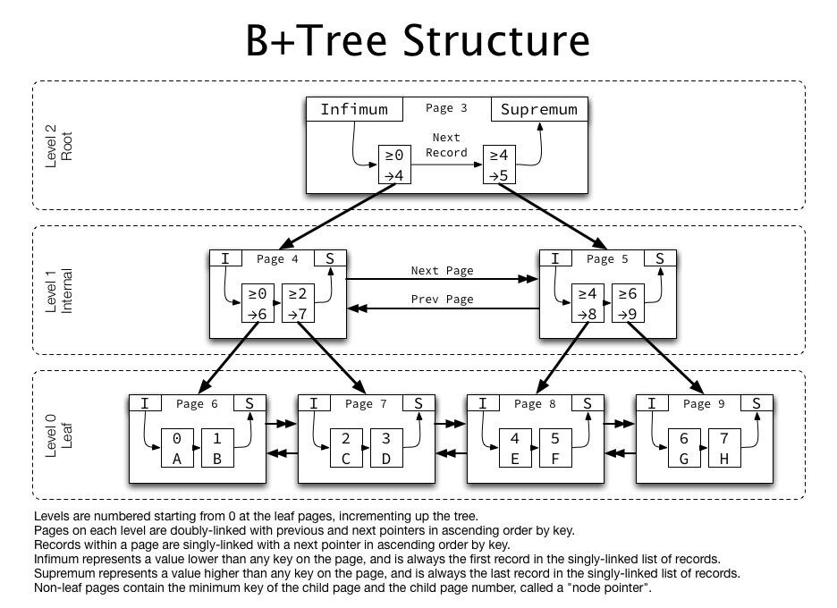

## Index

테이블의 검색, 정렬 속도를 향상시키기 위한 자료구조이다.
책 뒤에 색인을 보고 어떤 단어가 어떤 페이지에 있는지 찾는 것과 유사하다. 이 때 단어는 컬럼의 데이터, 페이지는 물리적 주소를 나타낸다.

### 특징

- 데이터와 물리적주소는 (key, value) 쌍으로 저장된다.
- index는 데이터들이 정렬된 형태이다. 그래서 where, order by, min/max는 빠르지만, 데이터를 추가하게되면 정렬을 유지하기 위해 추가 작업이 필요하다.
- update는 기존 인덱스 삭제 후 새로 index가 추가된다.
- delete시 인덱스 key를 실제로 삭제하지는 않고, 삭제 마킹를 한다. 그래서 수정, 삭제가 빈번하다면 쓰지 않는 인덱스가 늘어나면서 인덱스 크기가 커진다.
- insert, update시 비용이 추가로 들긴하지만, update, delete를 하기 위한 조회쿼리의 속도 또한 향상된다.

### 장점과 단점

`장점`

- 테이블 조회 속도 향상
- 시스템 부하 감소

`단점`

- DB내의 별도의 저장공간을 이용하여 index를 관리해야한다.
- 데이터 삽입, 변경이 자주 일어나면 매번 인덱스를 변경해야하므로 성능저하가 발생할 수 있다.

### 인덱스를 사용하면 좋은 컬럼

- 데이터가 많은 테이블
- insert, update, delete가 빈번하지 않은 컬럼
- join, where, order에 자주 사용되는 컬럼
- 데이터 중복이 적은 컬럼

### 인덱스의 자료구조

#### 해시 테이블

key, value 쌍으로 저장된다.
해시펑션을 이용하여 컬럼의 값으로 해시값을 계산한다.
이 때는 해시 충돌이 일어날 수 있다.
시간복잡도는 평균 O(1)으로 빠른 편이다.
해시 테이블의 단점은 등호(=) 연산만 가능하다는 것이다. 정렬되어 있지 않기때문에 부등호(<,>) 연산은 빠르게 찾을 수 없다.

#### B-트리

가장 일반적으로 사용되는 인덱스 알고리즘이다.
트리가 한쪽으로 편향되지 않고, 균형을 유지하는 밸런스드 트리의 일종이다. (B-트리인 이유는 Balanced에서 따온 것이다.)
최상위에 루트 노드가 있고, 가장 하위에 리프 노드, 루트와 리프 노드 사이의 노드를 브랜치 노드라고 한다.
이진탐색트리와 달리 자식 노드의 개수가 2개 이상이다.
균형잡힌 트리이기때문에, 높이가 노드 개수에 맞게 맞춰지므로 시간복잡도는 `O(logN)`이다. (=데이터 조회, 삽입, 삭제 시 시간복잡도)

#### B+트리

B-트리처럼 루트 노드, 브랜치 노드, 리프 노드로 나뉜다.
B-트리와의 차이점은 리프 노드만 데이터를 가지고 있고, 나머지 노드들은 검색을 위한 인덱스(key)만 가지고 있다는 것이다.
리프노드끼리 linked list로 연결되어있기 때문에 순차 검색에 유리하다.
시간복잡도는 `O(log2n)`이다.
InnoDB에서도 B+트리 구조를 사용한다.

### 인덱스 역할 종류

`프라이머리 키 인덱스`
<u>기본인덱스, 클러스터형 인덱스</u>라고도 한다.
테이블 하나당 하나만 가질 수 있다.
주로 PK를 기본인덱스로 설정하지만, PK가 아니어도 된다.
물리적으로 기본인덱스에 따라 행을 재배열한다.
테이블 자체가 인덱스이므로 따로 인덱스 페이지를 만들지 않는다.
세컨더리 인덱스보다 검색 속도가 더 빠르지만, 추가, 수정, 삭제는 느리다.

`세컨더리 인덱스`
<u>보조인덱스, 비클러스터형 인덱스</u> 라고도한다.
여러개를 만들 수 있다.
레코드의 원본은 정렬되어있지 않다. 인덱스 블록의 인덱스 키만 정렬되어야 한다.
리프 페이지가 데이터가 아닌, 데이터의 위치이기 때문에 기본인덱스보다는 느리지만, 데이터 입력, 수정, 삭제는 더 빠르다.
인덱스 생성 시 별도의 인덱스 페이지를 따로 만들기때문에 용량을 더 많이 차지한다.

### 복합 인덱스 설정 순서

여러 컬럼으로 조회를 할 때 복합 인덱스를 설정할 수 있다.
복합 인덱스는 생성 순서에 따라 성능이 달라지므로, 순서가 중요하다.

1. `같음`: == 또는 equal 등 같은지 비교하는 컬럼을 가장 먼저 설정
2. `정렬`: 정렬에 쓰이는 컬럼 설정
3. `다중 값`: 많은 값을 출력하는 컬럼 설정
4. `카디널리티`: 유니크한 정도가 높은 순서로 설정

### 인덱스 잘 활용하기

조회 조건에 사용된다고해서 모두 인덱스를 설정하기보다, 자주 사용되는지에 따라서 설정여부를 결정해야할 것 같다. 인덱스 저장공간과 데이터 수정시 저장속도 등을 희생해야하기 때문이다.

### 더 찾아볼 것

- 인덱스는 값의 앞부분 검색만 가능한가?
- 페이지 단위에 대해
- B-트리, B+트리 자세히
- 복합인덱스 설정시 인덱스 설정순서가 중요한 이유, 원리
