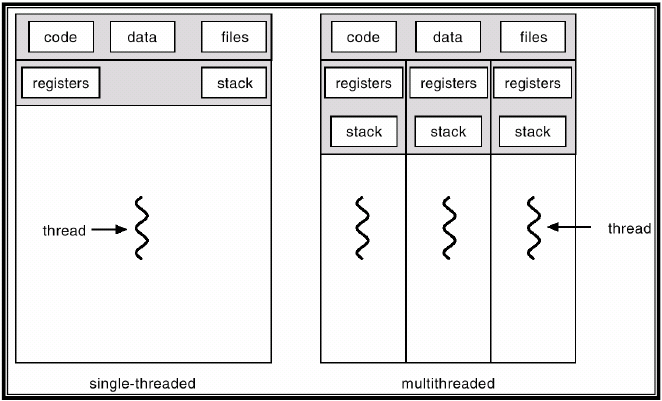

## Process & Thread

### 프로세스란?

- 메모리 상에서 실행중인 프로그램
- 메모리 영역
  - Code - 실행할 코드, 명령어들이 기계어로 저장된 형태
  - Data - 전역 변수, 정적 변수가 저장되는 영역
  - Stack - 함수 안에서 선언된 지역변수, 매개변수, 리턴값 등이 저장됨
  - Heap - 관리 가능한 데이터 외의 다른 형태의 데이터를 관리하기 위한 공간

### 스레드란?

- 프로세스 내에서 실행되는 흐름의 단위
- 하나의 프로세스는 기본적으로 하나의 스레드를 가지고 있으며, 여러 스레드를 동시에 가질 수도 있다. (멀티스레드)
- 별도의 register, stack을 가지며, 나머지(code, heap)는 프로세스내 다른 스레드와 공유한다.

### 프로세스와 스레드의 차이

- 프로세스는 메모리 상에서 실행중인 프로그램, 스레드는 프로세스 내에서 실행되는 흐름의 단위
- 프로세스는 최소 하나의 스레드를 가지고 있음
- 프로세스는 각 주소공간(code, data, heap, stack)을 독립적으로 할당받고 스레드는 stack, register만 따로 할당받고 나머지는 스레드끼리 공유

### 멀티프로세스

- 다수의 프로세서가 협력적으로 하나 이상의 작업을 동시에 처리하는 것
- 프로세스 중 하나에 문제가 생겨도 다른 프로세스에 영향을 주지 않음
- 독립된 메모리 영역이기 때문에 작업량이 많을수록 Context Switching이 자주 일어나 오버헤드가 발생할 가능성있음

### 멀티스레드

- 하나의 프로세스에 여러 스레드로 지원을 공유하며 작업를 나누어 수행하는 것
- 멀티 프로세스보다 적은 메모리 공간을 차지하고 Context Switching이 빠른 장점이 있음
- 동기화 문제로 한 스레드의 장애로 전체 스레드에 영향을 끼칠 수 있음

### 병렬 프로그래밍

- 동시적으로 실행되는 코드와 로직의 흐름을 만들어내는 것 (= 여러 스레드를 만들어 동작시키는 것)
- 동기화가 중요
- 데드락, 라이브락, 기아 상태, 성능 저하가 발생할 수 있음

#### 참고자료

https://cocoon1787.tistory.com/849
https://preamtree.tistory.com/10
https://hbase.tistory.com/308
