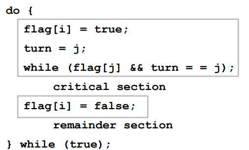
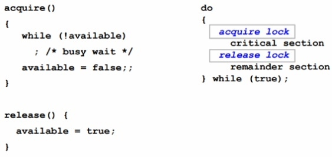
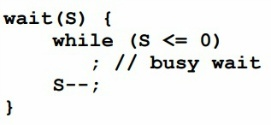

## 프로세스 동기화 (Process Synchronization)

여러 프로세스가 공유하는 자원의 일관성을 유지하는 것

### race condition (경쟁 상태)

여러 프로세스들이 동시에 데이터에 접근하는 상황에서, 어떤 순서로 데이터에 접근하느냐에 따라 결과 값이 달라질 수 있는 상황

### Critical Section Problem

Critical Section은 코드 상에서 Race condition이 발생할 수 있는 부분 (= 공유 데이터에 접근하는 부분)

CSP를 해결하기 위한 조건

1. `Mutual Exclusion (상호 배제)`: 이미 한 프로세스가 CS에서 작업 중이면 다른 프로세스는 CS에 진입하면 안됨
2. `Progress (진행)`: CS에서 작업 중인 프로세스가 없다면 CS에 진입하고자하는 프로세스가 존재하는 경우 진입할 수 있어야함
3. `Bounded Waiting (한정 대기)`: 프로세스가 CS에 들어가기 위해 요청한 후부터 그 요청이 허용될 때까지 다른 프로세스들이 CS에 들어가는 횟수에 한계가 있어야함 (=CS진입에 무한정 기다리면 안됨)

### CSP 해결 방법

#### Peterson's Solution

- `int turn;`
- `boolean flag[2]`

공유하는 2개의 데이터로 해결함  
위의 3가지 조건을 만족함

### Mutex Lock (뮤텍스 락)

프로세스는 임계구역(CS)에 들어가기 전에 Lock을 획득하고, 나올때 Lock을 반환해야함

`단점`: 임계구역에 들어가기 위해 acquire()을 계속 호출하는 Busy Waiting을 해야함

### Semaphore (세마포어)

- 뮤텍스 락과 유사함
- 세마포어는 임계구역에 들어가려고 할 때 값이 감소하고, 임계구역에서 나올 때 lock을 반납하며 값이 증가함
- 세마포어가 0 이면 자원이 모두 사용 중인 것을 의미함

#### 참고자료

https://hongku.tistory.com/17
https://hongku.tistory.com/18
