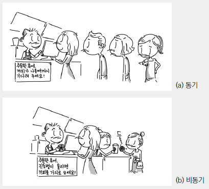

## 동기(synchronous), 비동기(Asynchronous)

### 동기

데이터의 요청과 결과가 한자리에서 동시에 일어나는 것 
-> 요청을 하면 시간이 얼마나 걸리던지 요청한 자리에서 결과가 주어져야함

### 비동기

요청과 결과가 동시에 일어나지 않음  
예) 콜백 함수

### 블로킹

응답이 오기까지 대기해야 하는 상태

### 논블로킹

응답을 기다리지 않고 다른 작업을 수행해도 되는 상태

#### 참고자료

https://velog.io/@slobber/%EB%8F%99%EA%B8%B0%EC%99%80-%EB%B9%84%EB%8F%99%EA%B8%B0%EC%9D%98-%EC%B0%A8%EC%9D%B4
https://dev-coco.tistory.com/46
