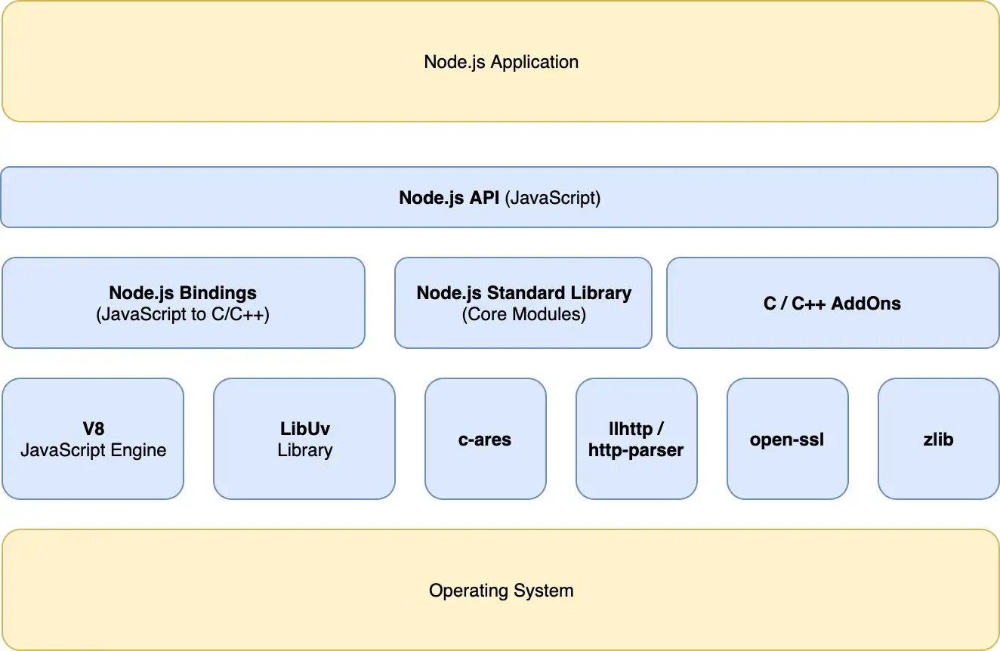

## Node.js

### Node.js란?

- 자바스크립트 런타임
- V8엔진으로 인해 브라우저에서만 실행 가능하던 javascript를 로컬에서 실행할 수 있게되었다.

### Node.js 구성요소

#### libuv

- Node.js가 사용하는 비동기 I/O 라이브러리
- 커널이 지원하는 비동기 작업은 커널에 요청
- 커널이 지원하지 않는 경우, 스레드 풀에 작업 위임
- 스레드 풀은 기본적으로 4개의 스레드를 가지고 있음
  -> Node.js는 I/O 작업을 메인스레드가 아닌 다른 스레드에 맡김으로써 논 블로킹 I/O를 지원한다.

#### 싱글스레드 논블로킹

`싱글스레드` - Node.js는 하나의 스레드(메인 스레드)로 동작한다.
`논블로킹` - I/O 작업이 들어와도 대기하지 않고, 비동기적으로 작업을 수행하여 블로킹 되지 않는다.

#### 이벤트루프

`역할`

1. 비동기작업을 스레드 풀에 위임
2. 이벤트 큐에서 실행 대기중인 콜백을 메인스레드에 의해 실행될 수 있도록 call stack으로 옮겨줌

`특징`

- 이벤트 루프 내부에는 6개의 단계(Phase)가 있음
- 각 단계별로 이벤트큐를 가짐
- Node.js는 각 단계를 돌면서 이벤트큐에 있는 콜백을 확인

#### 동작 순서

1. 이벤트 루프 생성
2. 작업 실행
3. 동기작업은 실행하고, 비동기 작업 콜백은 이벤트 루프의 큐에 넣는다.
4. 이벤트 루프 확인하여 남은 작업(콜백)이 있으면 실행
5. 남은 작업이 없으면 이벤트 루프 종료

### 추가로 알아볼 것

- Node.js에서 이벤트 루프가 죽었는지 살았는지 (작업이 남아있는지) 판단하는 방법 (코드 참고)
- Promise에서 이벤트루프 작동방식
- 싱글스레드 장단점

#### 참고자료

- https://chathuranga94.medium.com/nodejs-architecture-concurrency-model-f71da5f53d1d
- https://medium.com/zigbang/nodejs-event-loop%ED%8C%8C%ED%97%A4%EC%B9%98%EA%B8%B0-16e9290f2b30

[JavaScript Visualizer](https://www.jsv9000.app/)
