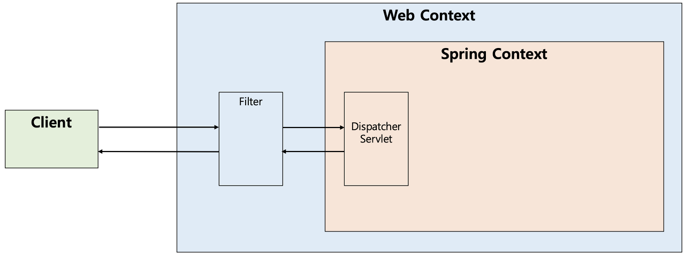

## Filter & Interceptor

### Filter

- 필터는 J2EE 표준 스펙 기능이며 디스패처 서블릿에 요청이 전달되기 전/후에 url 패턴이 맞는 모든 요청에 대해 부가 작업을 처리할 수 있는 기능을 제공한다.
- 스프링 컨테이너 밖에서 톰캣과 같은 웹 컨테이너에의해 관리가 된다. (스프링 빈으로 등록은 된다)
- 필터는 Request, Response 객체를 조작할 수 있다. (바꿔치기 할 수 있음)

### Interceptor

- Filter와 달리 Spring에서 제공하는 기술이며 디스패처 서블릿이 컨트롤러를 호출하기 전/후에 요청, 응답을 참고하거나 가공할 수 있는 기능을 제공한다.
- 스프링 컨텍스트에서 동작한다.
- 인터셉터에 사용되는 함수들은 Request, Response를 교체할 수 없고 boolean 값만 반환할 수 있다.

#### AOP

Interceptor 대신 AOP를 적용할 수도 있는데 컨트롤러 호출 과정에서 적용되는 부가기능들은 인터셉터를 사용하는 것이 낫다.

- 컨트롤러는 타입과 실행 메소드가 각각 달라서 포인트컷 작성이 어렵다
- 컨트롤러는 파라미터나 리턴 값이 일정하지 않다.
- AOP에서는 HttpServletRequset/Response 객체를 얻기 어려운반변 인터셉터에서는 파라미터로 넘어옴

#### 참고자료

https://mangkyu.tistory.com/173
