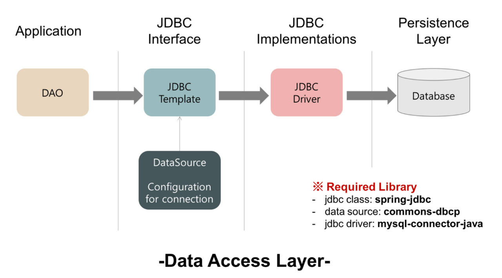

## JDBC

### Spring JDBC



### NamedParameterJdbcTemplate

- 기존의 ? 바인딩 대신 named parameter를 바인딩하여 사용할 수 있는 JdbcTemplate

```java
String sql = "INSERT INTO example_table (name, age) VALUES (:name, :age)";

// 쿼리 파라미터 설정
MapSqlParameterSource parameters = new MapSqlParameterSource();
parameters.addValue("name", name);
parameters.addValue("age", age);

// 쿼리 실행
jdbcTemplate.update(sql, parameters);
```

#### 참고자료
