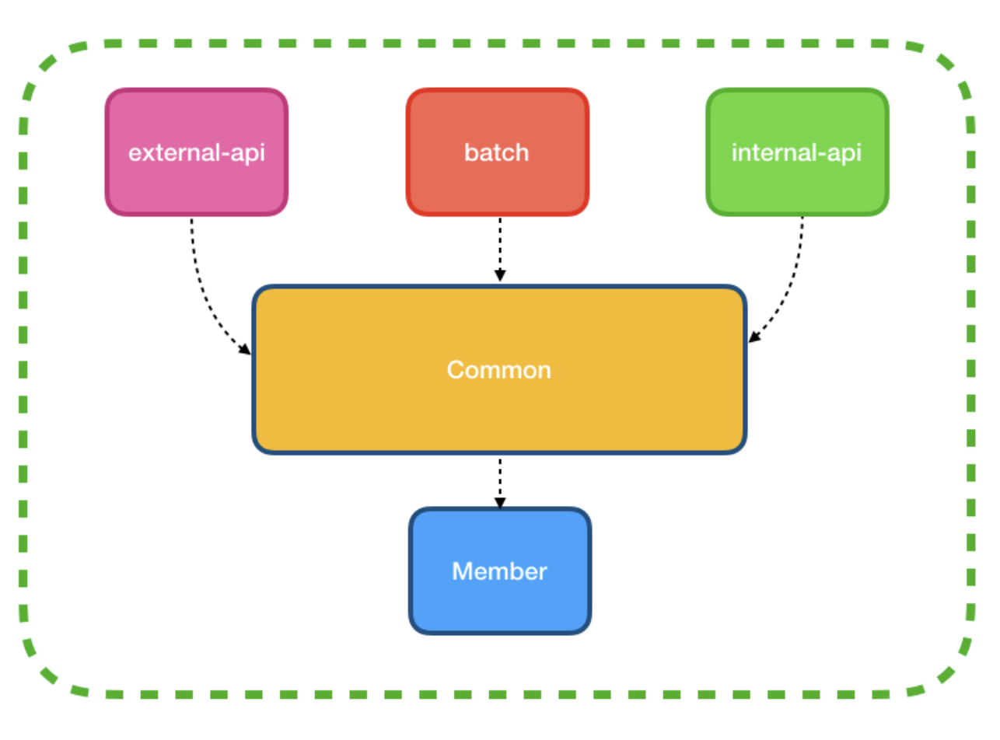
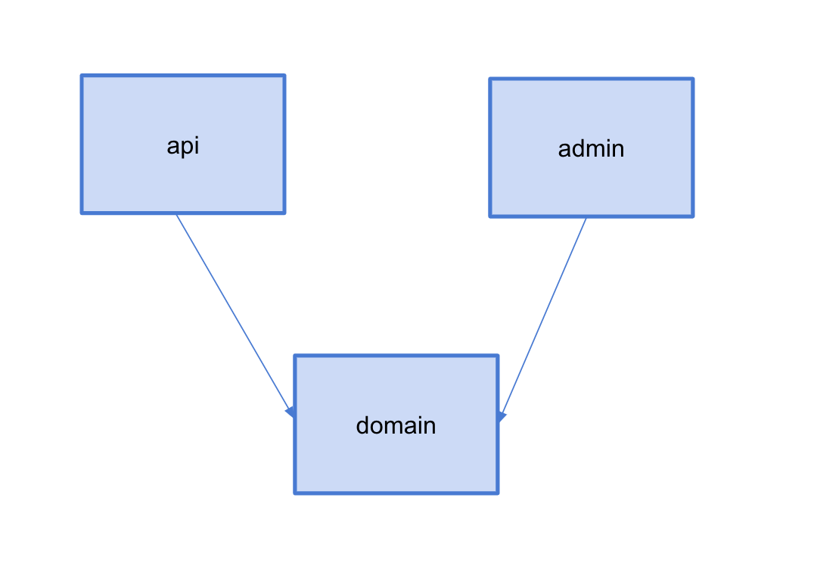
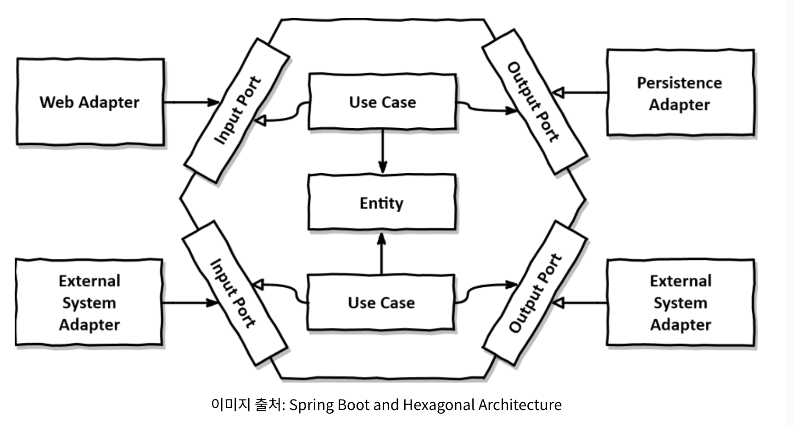

## Multi-module, Mono-repo

### Module

- 패키지 한 단계 위의 집합체
- 독립적르로 배포될 수 있는 코드 단위

### 싱글 모듈을 사용 하면

- api, admin, batch 프로젝트를 각각 만들어주어야함
- 공통으로 사용하는 Entity 코드도 각각 관리
- -> Entity 가 동일하다는 보장이 없어짐
- 수정이 필요하면 IDE로 일일이 열어줘야함..

### 멀티 모듈을 사용 하면

- 멀티모듈로 구성 시, Entity 코드를 하나만 두고, 여러 모듈에서 사용가능함 -> 한번의 수정 작업만 해주면 됨
- IDE로 하나의 프로젝트만 열어서 사용가능

### Common 모듈의 저주

출처: https://techblog.woowahan.com/2637/

- common 모듈을 두고, 공통으로 사용하는 코드를 모아둠
- 각 모듈에서 하는 일들을 줄어들고, common 모듈에서 하는 일은 점점 더 늘어남
- 리팩토링을 한다면 영향범위가 시스템 전체가 됨

### 구성 예시

### 조금 더 고민해볼 부분

- branch 전략 ([Trunk based Development](https://trunkbaseddevelopment.com/))
  
- 헥사고날 아키텍처
  
