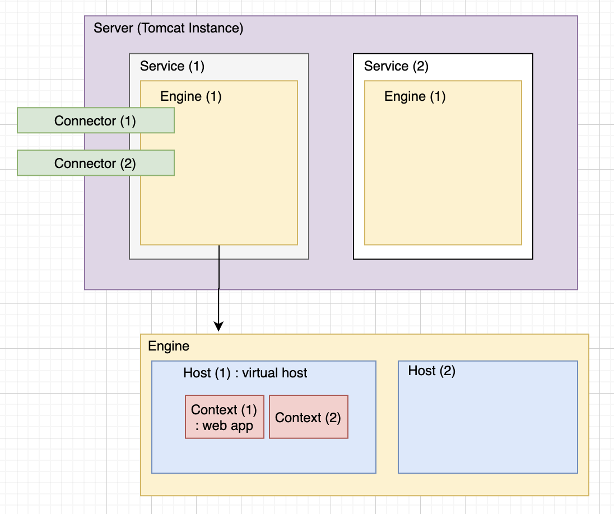

## Tomcat

WAS (Web Application Service)
톰캣은 JSP 환경을 포함하고 있는 servlet 컨테이너이다.

### 내부구조

Server: Tomcat instance, 하나의 프로세스
Service: Server안에 여러개 존재함. Service안에는 1개의 Engine과 여러개의 Connector가 있음
Engine: Connector로 들어온 요청을 하위 Host에게 전달해줌. 여러 Host가 존재함
Host: 가상호스트 이름을 나타내며, 호스트 이름이 곧 url에 매핑됨. 여러 Context가 존재함
Context: 하나의 Web Application. 주로 \*.war 형태로 배포. 여러 Servlet이 존재
Servlet: Controller와 유사한 개념

요청을 받으면 Catalina (Engine)가 요청에 맞는 context를 찾고 Context는 자신이 설정된 어플리케이션의 deployment descriptor file을 기반으로 전달받은 요청을 서블릿에게 전달하여 처리되도록함

#### 참고자료

https://velog.io/@hyunjae-lee/Tomcat-2-%EA%B5%AC%EC%A1%B0
