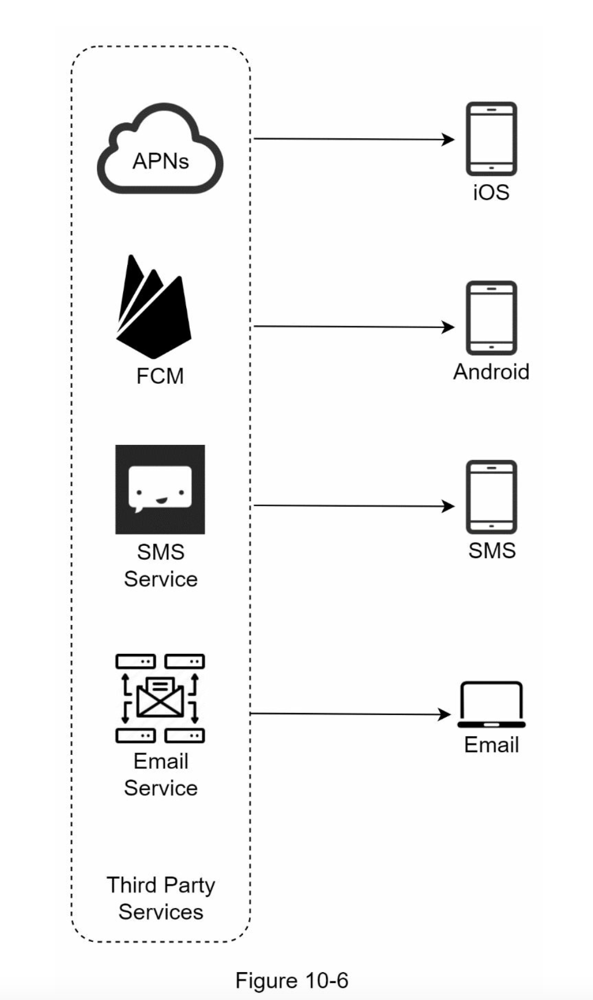
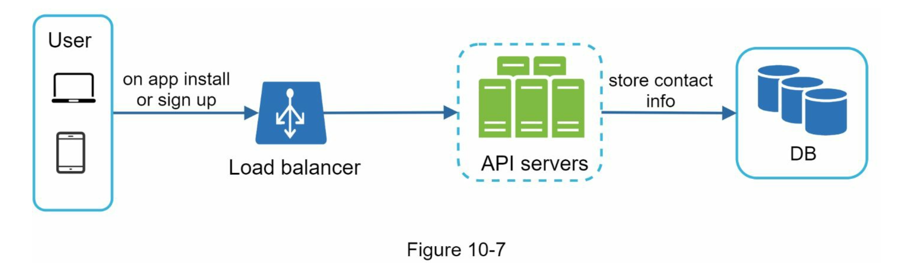
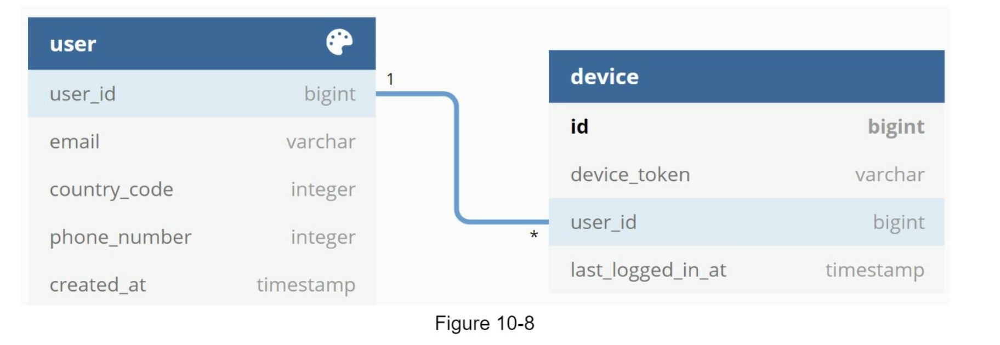
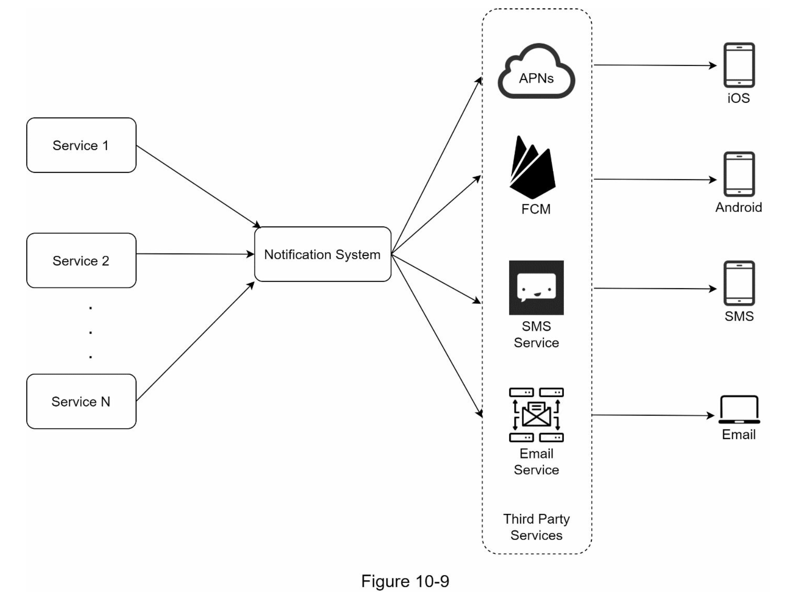
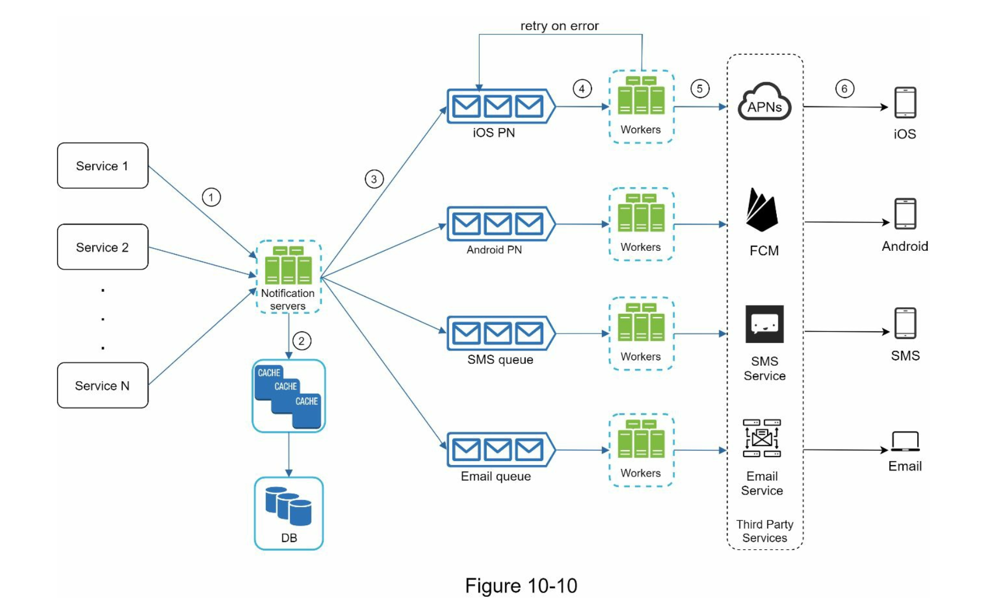
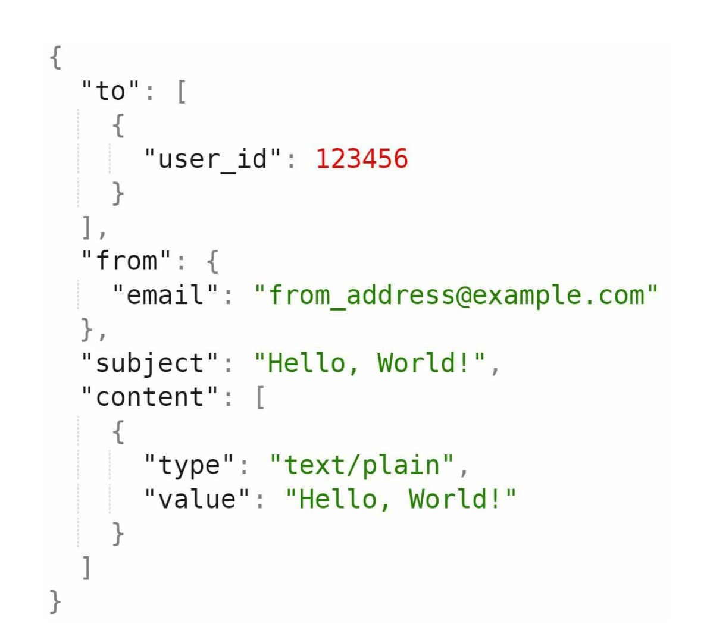
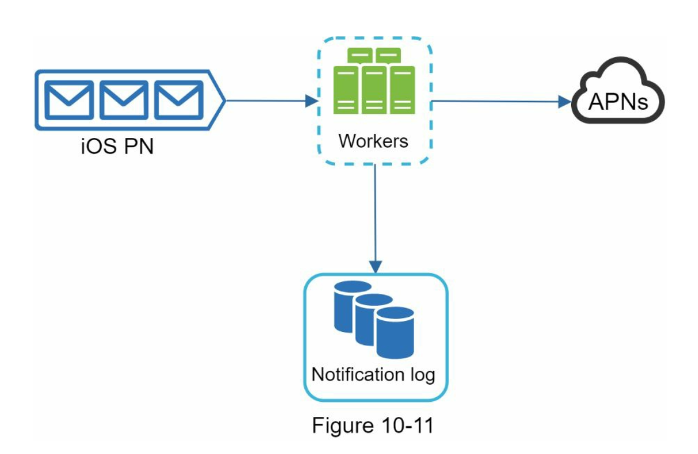
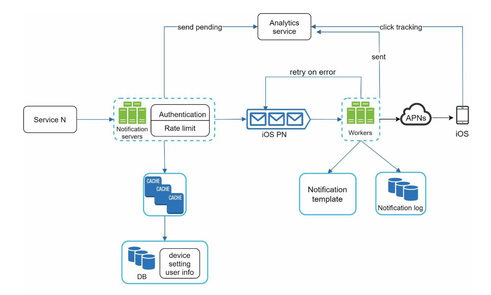

## 알림 시스템 설계

### 알림 시스템 종류

- 모바일 푸시 알림
- SMS 메세지
- 이메일

### 1단계 문제 이해 및 설계 범위 확정

- 푸시 알림, SMS 메세지, 이메일 지원
- 연성 실시간(Soft real-time) 시스템이라고 가정
  - <-> (Hard read-time)
- iOS, 안드로이드 단말, 랩톱/데스트옵 지원
- 알림은 클라이언트 애플리케이션 프로그램이 만들거나 서버측에서 스케줄링 가능
- 사용자가 알림 허용 여부 설정 가능
- 하루에 천만 건의 모바일 푸시 알림, 백만 건의 SMS, 5백만 건의 이메일을 보낼 수 있어야함

### 2단계 개략적 설계안 제시 및 동의 구하기

- 알림 유형별 지원 방안
- 연락처 정보 수집 절차
- 알림 전송 및 수신 절차

#### 알림 유형별 지원 방안

##### iOS

- 알림 제공자 -> APNS -> iOS 단말
- 알림 제공자: 알림 요청을 만들어 APNS에 보내는 주체
  - 필요한 데이타
    - 단말 토큰: 알림 요청을 보내는데 필요한 고유 식별자
    - 페이로드: 알림 내용을 담은 JSON
- APNS: 애플이 제공하는 원격 서비스. 푸시알림을 iOS로 전송
- iOS 단말: 푸시알림을 수신하는 사용자 단말

##### 안드로이드

- APNS 대신 FCM (Firebase Cloud Messaging) 사용
- 알림 제공자 -> FCM -> 안드로이드 단말

##### SMS

- 트윌리오, 넥스모 같은 제 3자 서비스 많이 이용함
- 국내 사업자: 알리고, 뿌리오, 메세지미 등..
- 대부분 상용 서비스라 요금 내야함 (예. 알리고 - 1건에 8.4원)

##### 이메일

- SMTP 서버를 이용해 이메일 전송
- AWS SNS + node-mailer
- 많은 회사가 상용 이메일 서비스 이용
- 샌드그리드, 메일 침프 등 -> 전송 성공률이 높고, 데이터 분석 서비스도 제공함

#### 연락처 정보 수집 절차

- 모바일 단말 토큰, 전화번호, 이메일 주소 등의 정보가 필요함
- 사용자가 가입 시 API 서버에서 해당 정보를 수집해서 DB에 저장

- 사용자가 여러 단말을 가질 수 있고, 모든 단말에 전송되어야한다는 것을 고려하여 설계

#### 알림 전송 및 수신 절차

##### 개략적 설계안 (초안)

- 1부터 N까지의 서비스
  - 마이크로서비스일 수도 있고, 크론잡일 수도 있고, 분산 시스템 컴포넌트일 수도 있음
- 알림 시스템
  - 알림 시스템은 알림 전송/수신 처리의 핵심
  - 일단 1개의 거버만 사용한다고 가정
  - 이 시스템은 서비스 1~N에 알림 전송을 위한 API 제공
  - 제 3자에 전달할 알림 페이로드를 만들어 낼 수 있어야함
- 제3자 서비스
  - 사용자에게 알림을 실제로 전달하는 역할
  - 확장성을 고려하여, 쉽게 새로운 서비스를 통합하거나, 제거할 수 있어야함
  - 어떤 서비스는 어떤 시장에서 사용할 수 없다는 것 고쳐해야함
  - 예를들어 FCM은 중국에서 사용할 수 없음
- 위 설계의 문제점
  - SPOF: 알림 서비스에 서버가 하나밖에 없음. 서버에 장애 쟁기면 전체 서비스에 장애로 이어짐
  - 규모 확장성: 한대 서비스로 푸시 알림을 모두 처리하므로 DB, 캐시 등 중요 컴포넌트의 규모를 개별적으로 늘릴 방법이 없음
  - 성능 명복: 알림을 처리하고 보내는 건 자원을 많이 필요로 하는 작업일 수 있음. 한 서버에서 처리하면 트래픽이 많이 몰리는 시간에 시스템이 과부하 상태에 빠질 수 있음

##### 개략적 설계안 (개선된 버전)

- 데이터베이스와 캐시를 알림 시스템의 주 서버에서 분리
- 알림 서버 증설, 자동적으로 수평적 규모 확장 이루어질 수 있도록함
- 메시지 큐를 이용해 시스템 컴포넌트 사이의 강한 결합을 끊음
- 알림 서버
  - 알림 전송 API: 스팸 방지를 위해 사내 서비스, 인증된 클라이언트만 이용 가능
  - 알림 검증: 이메일 주소, 전화번호 등에 대한 기본 검증 진행
  - 데이터베이스 또는 캐시 질의: 알림에 포함시킬 데이터를 가져옴
  - 알림 전송: 알림 데이터를 메세지 큐에 넣음. 하나 이상의 메세지 큐를 이용해서 병렬적으로 처리 가능
- API 호출 시 전송할 데이터(body) 사례

  

- 캐시: 사용자 정보, 단말 정보, 알림 템플릿 등을 캐시함
- DB: 사용자, 알림, 설정 등 정보를 저장
- 메세지 큐: 시스템 컴포넌트 간 의존성 제거를 위해 사용함. 다량의 알림이 전송되어야 하는 경우를 대비한 버퍼 역할도 함
- 작업 서버: 메세지 큐에서 전송할 알림을 꺼내서 제 3자 서비스로 전달
- 제 3자 서비스
- iOS, 안드로이드, SMS, 이메일 단말

### 3단계 상세 설계

#### 안정성

##### 데이터 손실 방지

- 알림이 어떤 상황에서도 소실되면 안됨
- 소실 방지를 위해 데이터를 데이터베이스에 보관하고, 재시도 매커니즘을 구현해야함

  

##### 알림 중복 전송 방지

- 분산 시스템의 특성 상 가끔 같은 알림이 중복 전송되기고 함
- 빈도를 줄이려면 중복을 탐지는 매커니즘을 도입, 오류를 신중하게 처리해야함
- 보내야할 알림이 도착하면, 이벤트 ID를 이용하여 이전에 본 적 있는 이벤트인지 살핌. 중복된 이벤트라면 버리고, 그렇지 않으면 알림 발송
- 중복 전송 방지가 100% 불가능한 이유?

#### 추가로 필요한 컴포넌트 및 고려사항

##### 알림 템플릿

- 알림 메세지의 형식이 주로 비슷하기 때문에 템플릿을 사용하면 좋음

##### 알림 설정

- 사용자가 알림 설정을 조정할 수 있게함
- 그 값은 DB에 boolean타입 등으로 저장

##### 전송률 제한

- 사용자에게 너무 많은 알림을 보내지 않도록 알림 빈도를 제한하는 것이 중요함

##### 재시도 방법

- 제 3자 서비스가 알림 전송에 실패하면, 해당 알림을 재시도 전용 큐에 넣음
- 같은 문제가 지속해서 발생하면 개발자에게 통지

##### 푸시 알림과 보안

- iOS, 안드로이드는 appKey, appSecret을 사용하여 인증된 클라이언트만 알림을 보낼 수 있음

##### 큐 모니터링

- 알림 시스템을 모니터링할 때 중요한 메트릭 하나는 `큐에 쌓인 알림 개수`
- 이 값이 너무 크면 이벤트가 빠르게 처리되지 못하고 있는 상태이므로, 작업 서버 증설이 필요함

##### 이벤트 추적

- 알림 확인율, 클릭율, 실제 앱 사용으로 이어지는 비율 같은 메트릭은 사용자를 이해하는데 중요함
- 데이터 분석 서비스는 보통 이벤트 추적 기능 제공함
- 알림 시스템을 만들면 데이터 분석 서비스와도 통합해야함 (GA 등)

#### 수정된 설계안

- 알림 서버에 인증과 전송률 제한 기능이 추가됨
- 전송 실패에 대응하기 위한 재시도 기능 추가, 실패하면 다시 큐에 넣고 지정된 횟수만큼 재시도
- 전송 템플릿 사용
- 모니터링과 추적 시스템 추가
