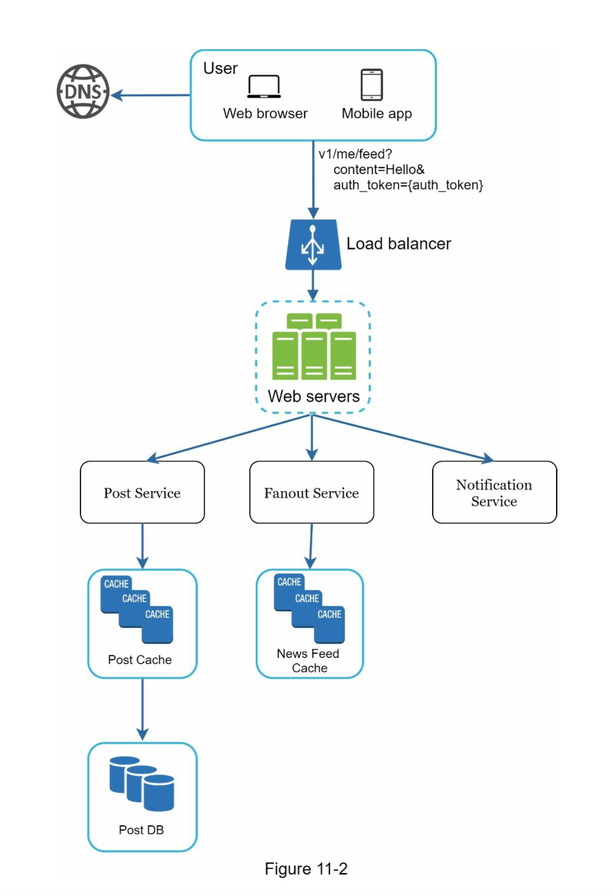
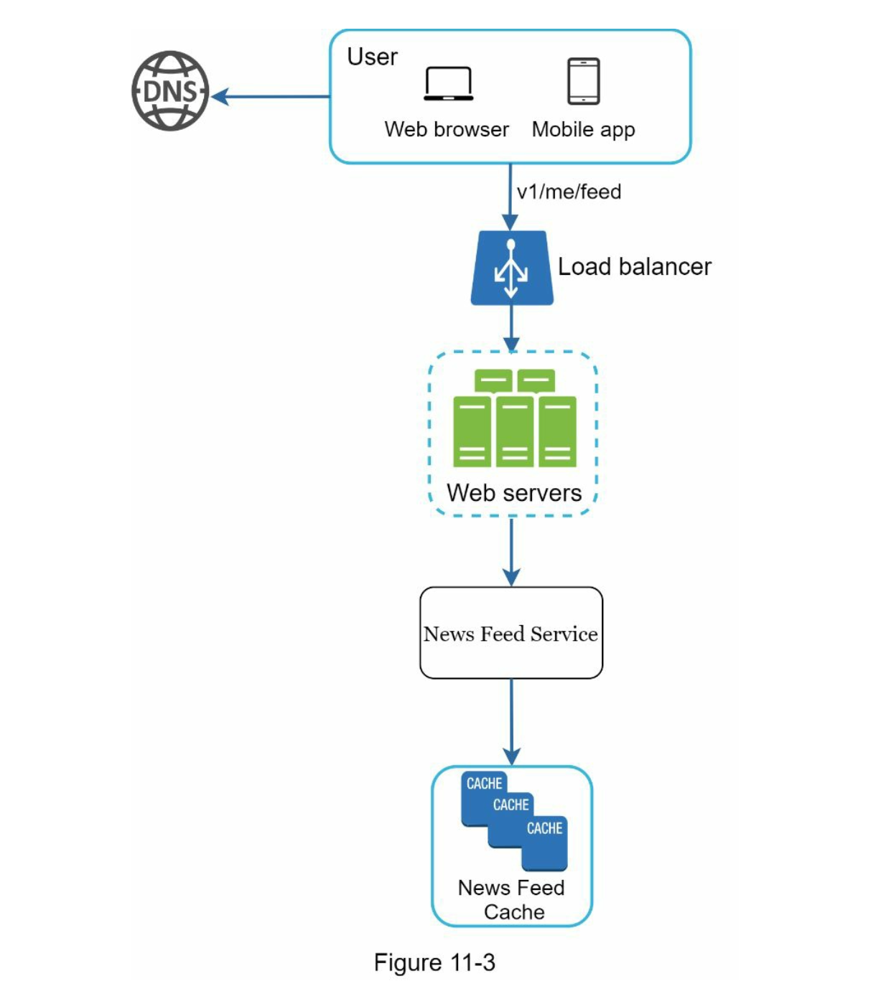
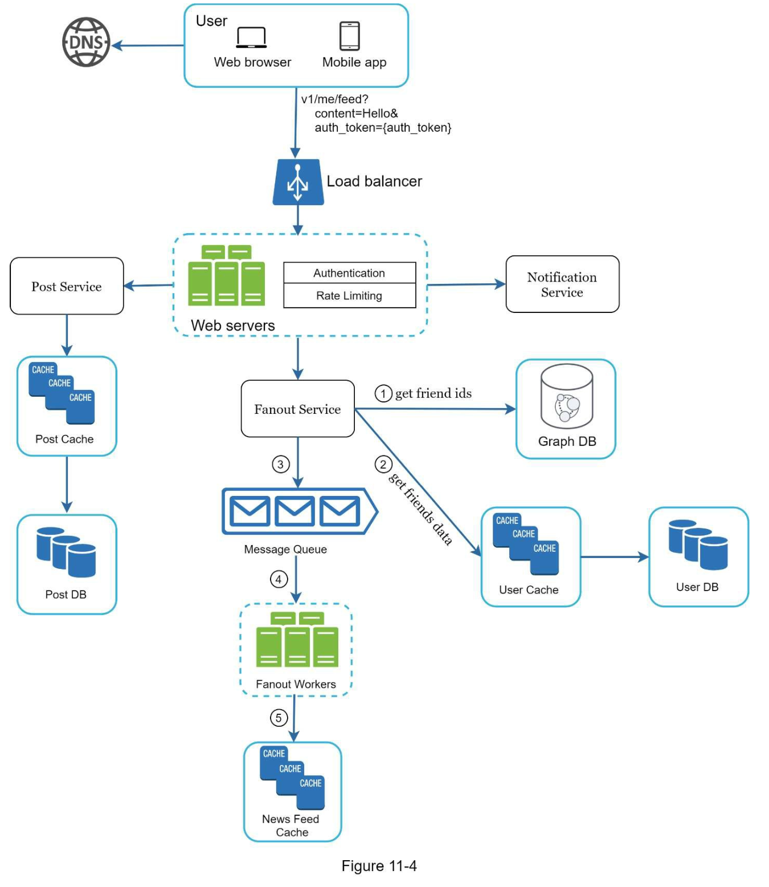
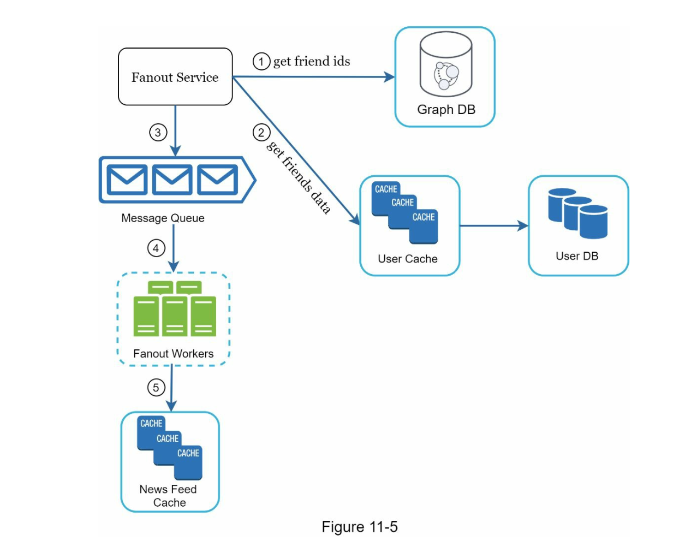
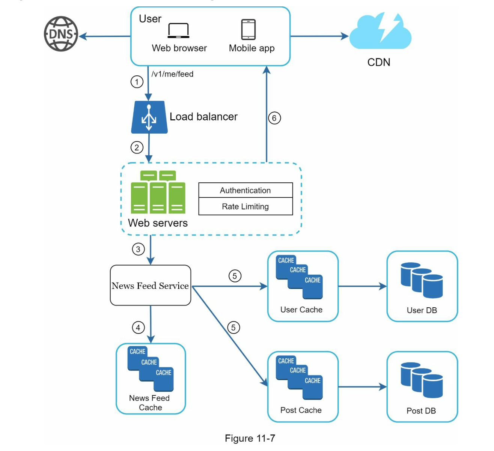
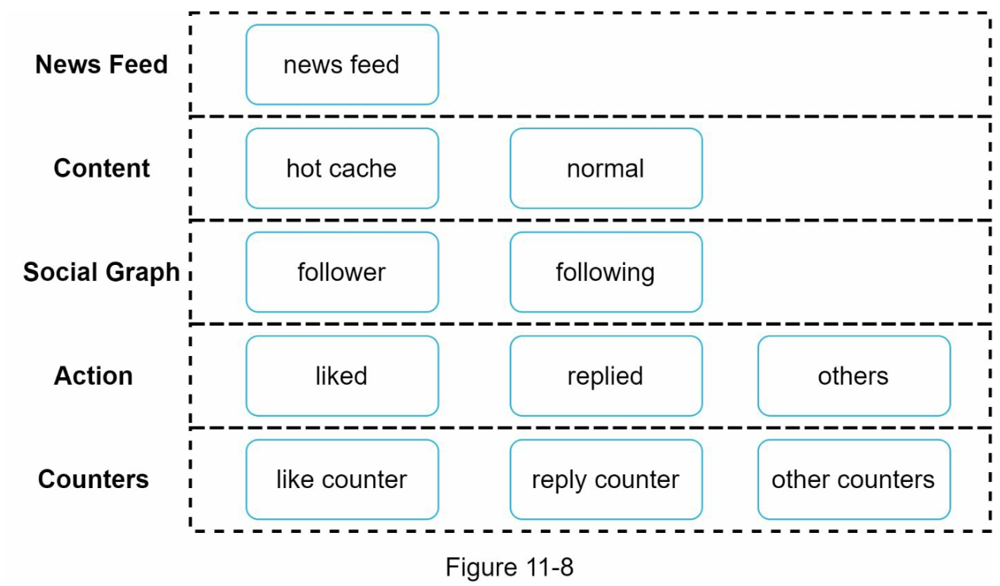

## 뉴스피드 시스템 설계

### 1단계 문제 이해 및 설계 범위 확정

- 모바일, 웹 지원
- 사용자가 뉴스피드에 새로운 스토리 올리기, 친구들이 올린 스토디 보기 기능
- 뉴스피드는 시간 흐름 역순으로 표시됨
- 한 명의 사용자는 최대 5000명의 친구를 가질 수 있음
- 매일 천만명이 방문한다고 가정
- 이미지, 비디오 등 미디어 파일 포함 가능

- -> 마지막 3가지 항목은 설계에서 어떻게 사용되었는지 잘 모르겠음

### 2단계 개략적 설계안 제시 및 동의 구하기

#### 피드 발행



1. 포스팅 저장 서비스

   - 포스팅을 캐시, DB에 저장

2. 포스팅 전송 서비스 (Fanout)
   - 친구의 뉴스피드에 push
   - 뉴스 피드 데이터는 캐시에 보관하여 빠르게 읽어갈 수 있도록 한다
3. 알림 서비스
   - 친구들에게 새 포스팅 알림, 푸시알림

#### 뉴스 피드 생성



- 뉴스 피드 서비스

  - 캐시에서 뉴스 피드를 가져오는 서비스

- 뉴스 피드 캐시
  - 뉴스 피드를 렌더링할 때 필요한 피드 ID를 보관함

### 3단계 상세 설계

#### 피드 발행 흐름 상세 설계



##### 웹 서버

- 클라이언트와 통신
- 인증, 처리율 제한 기능

##### 포스팅 전송(팬아웃) 서비스

- 새 포스팅을 사용자와 친구인 사용자들에게 전달하는 과정
- 팬아웃 모델 2가지

  1. 쓰기 시점에 팬아웃 (푸시 모델)

  - 새로운 포스팅을 기록하는 시점에 뉴스 피드 갱신
  - 장점1) 뉴스피드가 실시간으로 갱신, 즉시 전송
  - e.g. 인스타 새 게시물 알림
  - 장점2) 뉴스 피드를 읽는데 드는 시간이 짧아짐
  - 단점1) 친구가 많은 경우, 많은 사용자의 뉴스피드를 갱신해야하므로 시간이 오래 걸림 (핫키 문제)
  - 단점2) 서비스를 자주 사용하지 않는 사용자의 뉴스 피드까지 갱신해야함

  2. 읽기 시점에 팬아웃 (풀 모델)

  - 사용자가 피드를 읽는 시점에 뉴스 피드 갱신
  - 요청 기반 모델
  - 장점1) 비활성화된 사용자, 자주 사용하지 않는 사용자의 뉴스 피드를 갱신하지 않아도 됨
  - 장점2) 핫키 문제도 발생하지 않음
  - 단점1) 뉴스 피드를 읽는데 시간이 오래 걸릴 수 있음

##### 포스팅 전송(팬아웃) 서비스 설계안

- 뉴스 피드를 빠르게 가져오는 것이 중요하므로, 대부분 사용자에 대해 `푸시 모델` 사용
- 팔로어가 아주 많은 사용자의 경우 `풀 모델` 사용
- 팔로어가 많다의 기준은 어떻게 잡을 것인가?
  - 시스템의 평균 팔로어 수, 분포를 고려하여 결정하면 될 듯
  - 또는 퍼센트를 이용하여 상위 n% 사용자의 팔로어 수를 많다고 설정할 수도 있음
- 안정 해시를 통해 요청과 데이터를 고르게 분산하여 핫키 문제 줄여볼 것임
  - `안정 해시`: 데이터를 고르게 분산하고, 데이터 추가, 삭제 시에도 데이터 이동이 적게 일어나는 해싱 기법
  - 데이터 저장소 부하 분산, 요청 처리 부하 분산, 데이터 재배치 최소화



1.  그래프 데이터 베이스에서 친구 ID 목록 가져옴

    - 그래프 데이터베이스는 친구 관계, 친구 추천에 적합함

    - 그래프 데이터베이스
      - 노드, 엣지로 구성됨
      - 관계형 데이터베이스는 join 사용, 하지만 그래프 데이터베이스는 노드, 엣지를 사용하여 빠르게 조회 가능
    - 관계 중심의 쿼리 제공
      ```sql
      MATCH (user:User {id: 'user123'})-[:FRIEND]->(friend)
      RETURN friend
      ```
    - 친구 추천 등 소셜 네트워크 특화 기능 지원

2.  사용자 정보 캐시에서 사용자 정보 가져옴

    - 사용자의 설정에 따라 mute된 친구의 스토리는 제외, 일부 사용자에게만 공개 등, 스토리 필터링을 함

3.  친구 목록, 새 스토리 포스팅 ID를 메세지 큐에 넣음
4.  팬 아웃 서버가 메세지 큐에서 데이터를 꺼내서 뉴스 피드 캐시에 넣음

    - 뉴스 피드 캐시는 <포스팅ID, 사용자ID> 순서쌍을 보관하는 매핑 테이블
    - 메모리 문제 때문에 포스팅 정보, 사용자 정보를 모두 넣지는 않음
    - 캐시 크기에도 제한을 둔다
    - 사용자가 모든 피드를 다 읽어볼 가능성은 적기때문에 캐시 미스가 일어날 확률은 낮음

#### 피드 읽기 흐름 상세 설계



##### 캐시 구조



### 4단계 마무리

#### 데이터베이스 규모 확장

- 수직적 규모 확장 vs 수평적 규모 확장
- SQL vs NoSQL
- 주-부(master-slave) 다중화
- 복제본(replica)에 대한 읽기 연산
- 일관성 모델 (Consistency Model)
- 데이터베이스 샤딩

#### 논의해보면 좋을 것들

- 웹 계증을 무상태(stateless)로 운영하기
- 가능한 많은 데이터를 캐시할 방법
- 여러 데이터 센터를 지원할 방법
- 메세지 큐를 이용하여 컴포넌트 사이의 결합도 낮추기
- 핵심 메트릭에 대한 모니터링, 트리팩이 몰리는 시간대의 QPS, 사용자가 뉴스 피드를 새로고침 할 때의 지연시간 등
- +) 뉴스 피드 캐시 분산처리 - 샤딩, 분산 캐시 시스템 사용 (Redis Cluster, Memcached) 등
