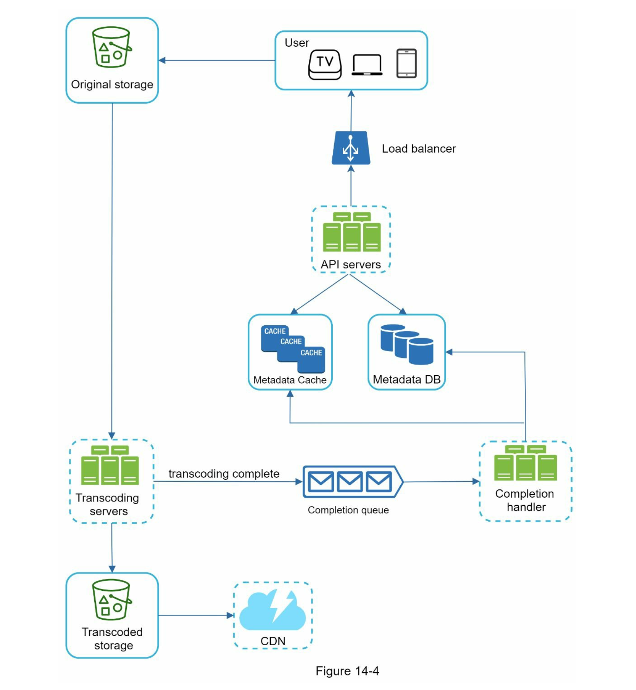
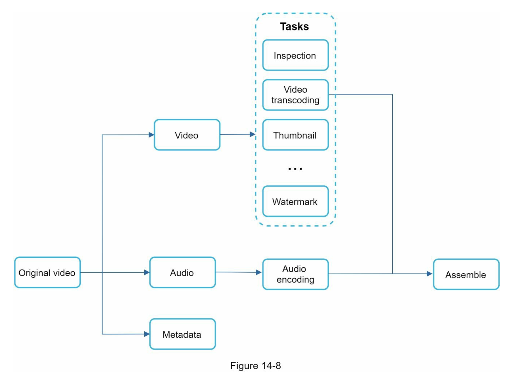
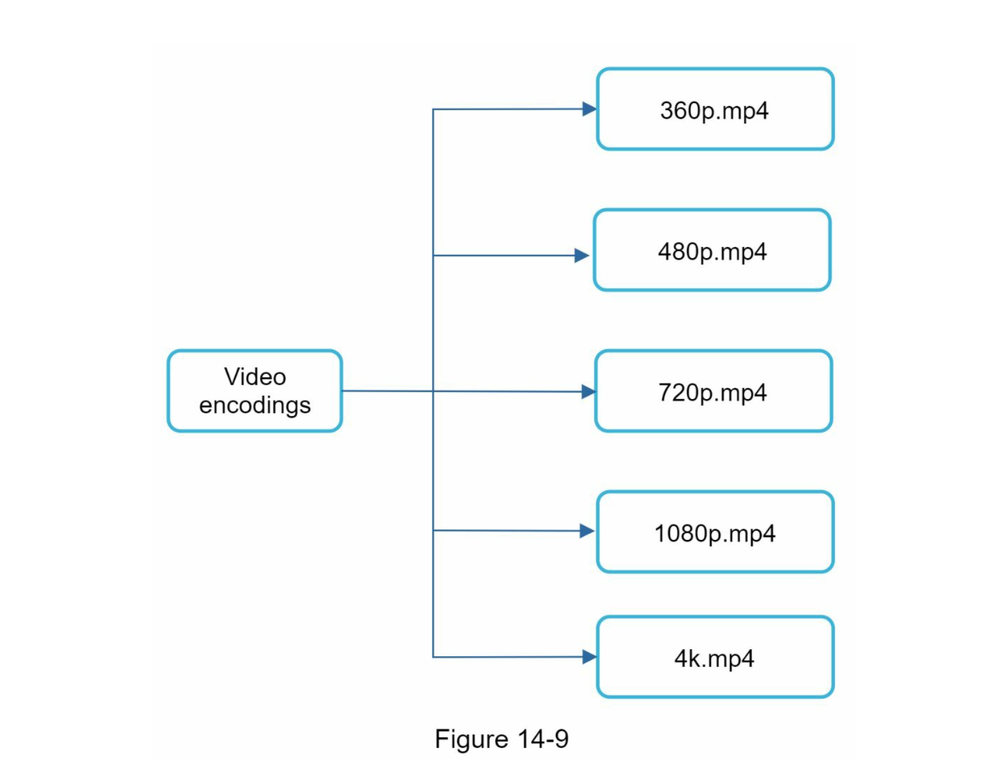
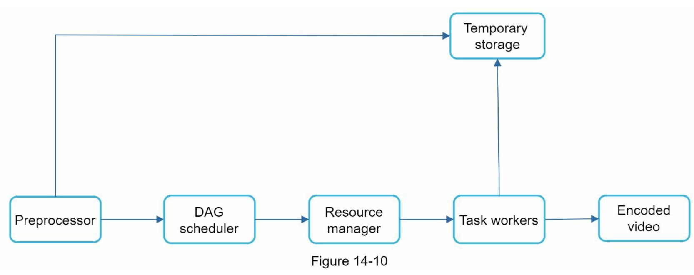

### 1단계 문제 이해 및 설계 범위 확정

#### 요구 사항

- 비디오 업로드, 시청 하는 기능
- 모바일 앱, 웹 브라우저, 스마트 TV 지원
- 일간 능동 사용자(DAU) 수 5백만
- 사용자가 평균적으로 소비하는 시간 30분
- 다국어 지원
- 대부분의 비디오 해상도 지원
- 암호화 필요
- 비디오 파일 크기 제한 (최대 1GB)
- 클라우드 서비스 활용가능

### 설계할 부분

- 빠른 비디오 업로드
- 원활한 비디오 재생
- 재생 품질 선택 기능
- 낮은 인프라 비용
- 높은 가용성, 규모 확장성, 안정성
- 지원 클라이언트: 모바일 앱, 웹브라우저, 스마트TV

#### 개략적 규모 추정

- DAU 500백만
- 한 사용자는 하루 평균 5개의 비디오 시청
- 10%의 사용자가 하루에 1 비디오 업로드
- 비디오 평균 크기는 300MB
- 비디오 저장을 위해 매일 새로 요구되는 저장 용량 = 5백만 X 10% X 300MB = 150TB
- CDN 비용
  - CF를 사용하고, 100% 미국에서 트래픽 발생 시 1GB당 0.02달러 요금 발생
  - 매일 발생하는 요금은 5백만 _ 5비디오 _ 0.3GB \* $0.02 = $150,000 ! 엄청나군...

### 2단계 개략적 설계안 제시 및 동의 구하기

#### BLOB 스토리지

- 비디오를 저장하기 위해 사용할 저장소
- ?

- CDN, BLOB 저장소를 직접 구현할 필요는 없고, 클라우드 서비스를 사용하면 되므로 패스

#### 설계해야하는 부분

- 비디오 업로드 절차
- 비디오 스트리밍 절차

#### 비디오 업로드 절차

- 메타데이터 DB: 비디오의 메타데이터를 보관, 샤딩, 다중화 적용하여 성능 및 가용성 요구사항 충족
- 메타뎅터 캐시: 성능을 높이기 위해 비디오 메타데이터와 사용자 객체 캐시 - 사용자 객체?
- 원본 저장소: 원본 비디오를 보관할 대형 이진 파일 저장소 (Binary Large Object Storage) - blob타입과 같은건가?
  - 이진 데이터를 하나의 개체로 보관하는 데이터베이스 관리 시스템
- 트랜스코딩 서버: 비디오 인코딩이라고도함, 비디오 포맷 변환 절차. 대역폭 요구사항에 맞는 최적의 비디오 스트림 제공을 위해 필요함
- 트랜스코딩 비디오 저장소: 트랜스코딩이 완료된 비디오를 저장하는 BLOB 저장소
- CDN: 비디오 캐싱
- 트랜스코딩 완료 큐: 비디오 트랜스코딩 완료 이벤트를 보관할 메세지 큐
- 트랜스코딩 완료 핸들러: 트랜스코딩 완료 큐에서 이벤트 데이터를 꺼내어 메타데이터 캐시와 데이터베이스를 갱신할 작업 서버

#### 비디오 스트리밍 절차

##### 스트리밍 프로토콜

- MPEG-DASH (Moving Picture Experts Group - Dynamic Adaptive Streaming over HTTP)
- 애플 HTTP Live Streaming (HLS)
- Microsoft Smooth Streaming
- Adobe HTTP Dynamic Streaming (HDS)

- 프로토콜마다 지원하는 비디오 인코딩이 다르고, 플레이어도 다름
- 서비스에 맞는 프로토콜을 잘 골라야함
- 비디오는 CDN에서 바로 스트리밍됨
- 사용자 단말에 가장 가까운 CDNㅇ 에지 서버가 비디오 전송을 담당할거임
- -> 전송 지연은 낮음

### 3단계 상세 설계

#### 비디오 트랜스코딩

- 비디오가 다른 단말에서도 잘 재생되게 하려면, 호환되는 비트레이트(bitrate)와 포맷으로 저장되어야함
- 비트레이트는 비디오를 구성하는 비트가 얼마나 빨리 처리되어야 하는지를 나타냄
- 비트레이트가 높은 비디오는 주로 고화질 비디오임
- 비트레이트가 높은 비디오 스트림을 재생하려면 높은 성능의 컴퓨팅 파워, 대역폭이 필요함

##### 비디오 트랜스코딩이 중요한 이유

- 저장공간
- 비디오 포맷
- 대역폭에 맞는 비트레이트의 비디오 스트림 제공
- 비디오 화질을 자동, 수동으로 선택할 수 있게 함

##### 인코딩 포맷 - 다양한데, 대부분 아래 두 부분으로 구성됨

- 컨테이너: 비디오, 파일, 오디오, 메타데이터를 담는 바구니 같은 것, .avi, .mov, .mp4 같은 파일 확장자를 보면 알 수 있음?
- 코덱(codec): 비디오 화질을 보존하면서 파일 크기를 줄이는 알고리즘, H.264, H.265 같은 것?

#### 유향 비순환 그래프(DAG) 모델

- 서로?
- 이게 왜 유향 비순환 그래프(DAG) 모델 인거지? 개념은 멀까

- 원본 비디오는 일반 비디오, 오디오, 메타데이터 세 부분으로 나뉘어 처리됨
- 비디오 부분에 적용되는 작업은 검사, 비디오 인코딩, 섬네일, 워터마크

#### 비디오 트랜스코딩 아키텍처

#### 전처리기

1. 비디오 분할

- GOP (Group of Pictures) 단위로 비디오를 분할
- GOP란 특정 순서로 배열된 프레임 그룹
- 하나의 GOP는 독립적으로 재생 가능

2. DAG 생성

#### 시스템 최적화
