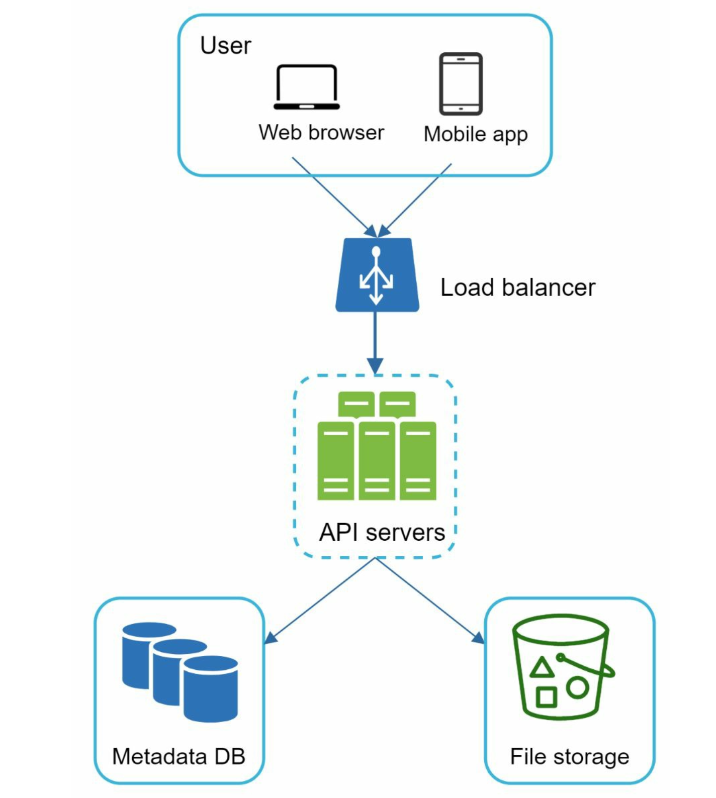
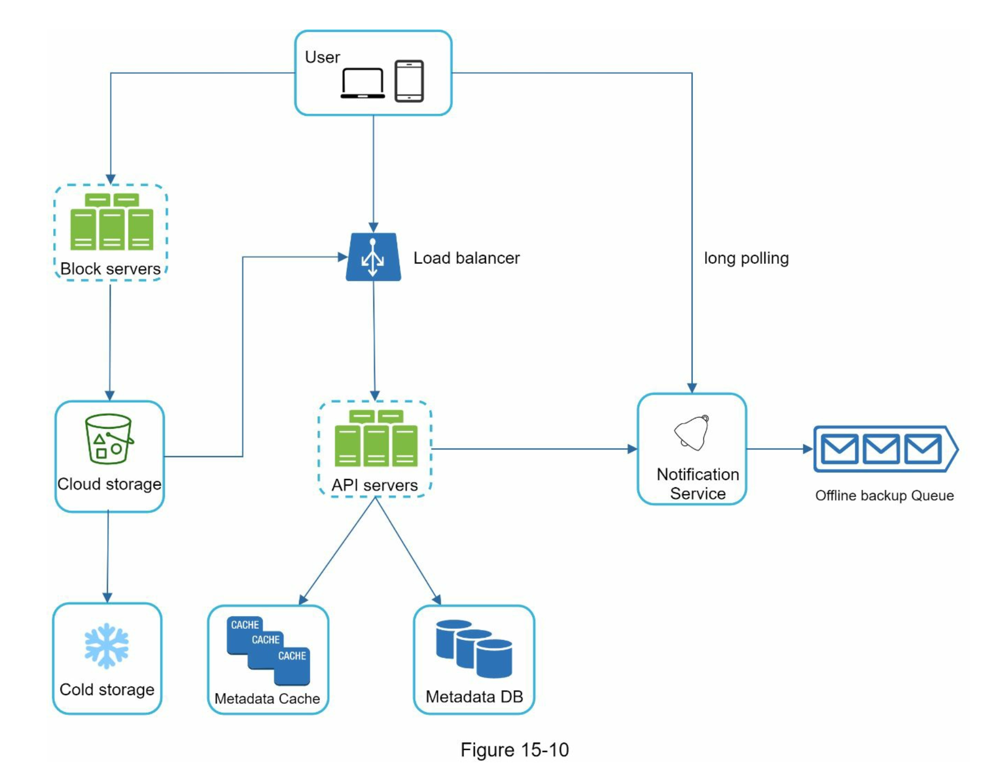
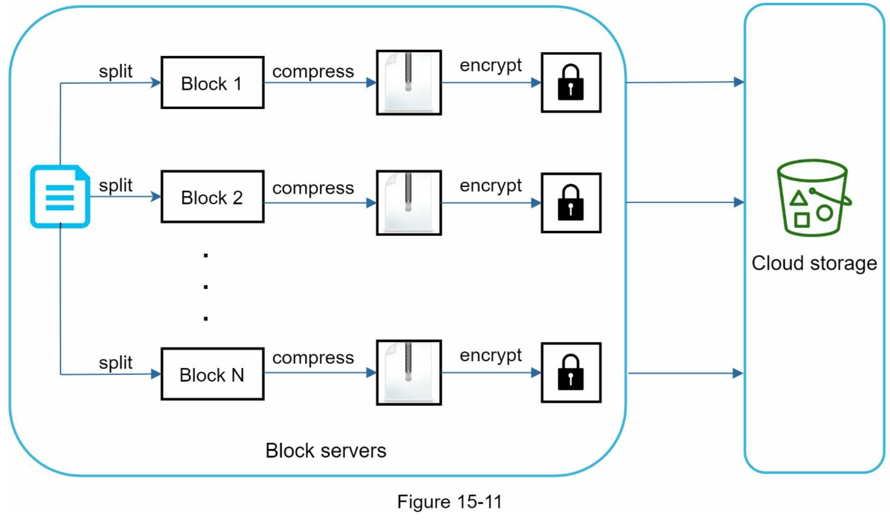
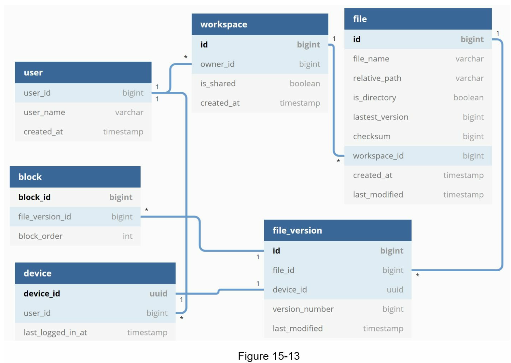
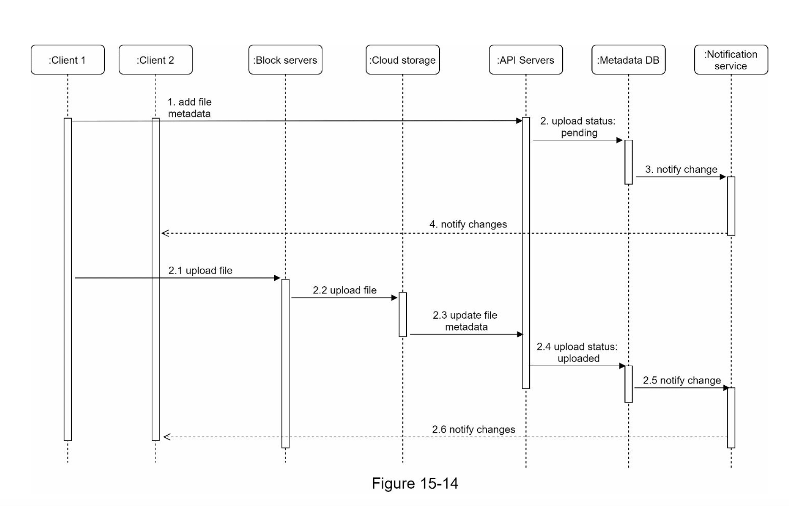
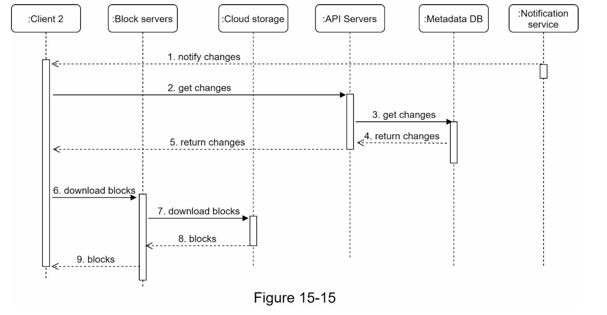

## 구글 드라이브 설계

### 1단계 문제 이해 및 설계 범위 확정

#### 기능적 요구 사항

- 파일 업로드
- 다운로드
- 여러 단말에 동기화
- 파일 갱신 이력 조회
- 파일 공유
- 파일 편집, 삭제, 공유 시 알림

#### 비기능적 요구 사항

- 안정성
- 빠른 동기화 속도
- 네트워크 대역폭
- 규모 확장성
- 높은 가용성

#### 개략적 추정치

- DAU 5천만
- 10GB 무료 저장공간
- 매일 각 사용자가 평균 2개 파일 업로드 시, 각 파일 평균 크기는 500KB
- 읽기:쓰기 비율 1:1
- 필요한 저장공건 총량 = 5천만 \* 10GM = 500PB
- 업로드 API QPS = 1천만 사용자 \* 2회 업로드 /24시간/3600초 = 약 240
- 최대QPS = 2배 = 480

### 2단계 개략적 설계

#### 서버 1대인 경우

- 웹 서버, 데이터베이스, 저장소 시스템을 1대에 모두 두는 경우

#### 파일 업로드 API

1. 단순 업로드

- 파일 크기가 작을 때 사용

2. 이어 올리기

- 파일 사이즈가 크고, 네트워크 문제로 업로드가 중단될 가능성이 높을 때 사용
- uploadType-resumable
- data: 업로드할 로컬 파일
- 이어올리기 URL을 받기 위한 최초 요청 전송
- 데이터를 업로드하고, 업로드 상태 모니터링
- 업로드에 장애 발생 시 발생시점으로부터 업로드 재시작

#### 파일 다운로드 API

#### 파일 갱신 히스토리 API

- 이 3개 API들은 모두 사용자 인증을 필요로하고, HTTPS 프로토콜 사용해야함

#### 한 대 서버의 제약 극복

- 저장소로 AWS S3 사용
- S3는 다중화를 지원함, 같은 지역에 다중화할수도 있고, 여러 지역에 걸쳐 다중화도 가능함

#### 동기화 출돌

- 두 명이상의 사용자가 동시에 같은 파일을 수정할 때 충돌이 발생할 수 있음
- 먼저 처리되는 변경은 성공한 것으로 보고, 나중에 처리되는 변경은 충돌로 처리
- 오류가 발생한 시점에 두가지 버전이 존재하게됨
- 두 파일을 하나로 합칠지, 둥 중 하나를 다른 파일로 대체할지 정해야함

- 사용자 단말: 사용자가 파일을 업로드, 다운로드, 수정하는 단말
- 블록 저장소 서버: 파일 블록을 클라우드 저장소에 업로드하는 서버
  - 파일을 여러 블록으로 나누어 저장
- 아카이빙 저장소: 오랫동안 사용되지 않는 파일을 저장하는 저장소
- 로드밸런서: 사용자 요청을 서버로 분배
- 메타데이터 데이터베이스: 파일 메타데이터를 저장하는 데이터베이스
- 메타데이터 캐시: 메타데이터를 캐싱
- 알림 서비스: 파일 공유, 편집, 삭제 시 알림을 보내는 서비스
- 오픙라인 사용자 백업 큐: 클라이언트가 접송 중이 아니라서 최신 상태를 알 수 없을 때, 정보를 이 큐에 두어 나중에 클라이언트가 접속하면 정보를 전달

### 3단계 상세 설계

#### 블록 저장소 서버

- 델타 동기화
  - 사용자가 파일을 수정할 때, 수정된 블록만 업로드
- 압축

  - 블록을 압축하여 저장

- 새 파일이 업로드 되었을 때 블록 저장소 서버가 동작하는 과정
  1. 파일을 블록으로 나눔
  2. 블록을 압축
  3. 블록을 클라우드 저장소에 업로드
  4. 메타데이터 데이터베이스에 파일 정보 저장
  5. 사용자에게 파일 업로드 완료 알림

#### 높은 일관성 요구사항

- 메타데이터 캐시와 데이터베이스 계층에 강한 일관성 적용해야함
- 메모리 캐시는 최종 일관성 모델을 사용
- 강한 일관성 달성하려면 다음 사항 보장해야함
  - 메모리 캐시에 저장된 메타데이터는 데이터베이스에 저장된 메타데이터와 일치해야함
  - 데이터베이스에 ㅂ고ㅘㄴ된 원본에 변경이 발생하면 캐시에 있는 사본 무효화

#### 메타데이터 데이터베이스

- 스키마

#### 업로드 절차

#### 다운로드 절차

#### 알림 서비스

- 롱 폴링: 클라이언트가 서버에 주기적으로 요청을 보내는 방식
- 웹 소켓: 클라이언트와 서버 간 양방향 통신을 지원하는 프로토콜

- 롱 폴링 사용, 알림 서버와 롱 폴링 연결을 유지하다가 특정 파일에 대한 변경을 감지하면 연결을 끊음
- 클라이언트는 파일의 최신 내역을 서버에서 다운로드해야함
- 새 요청을 보내서 롱 폴링 연결을 다시 맺음

#### 저장소 공간 절약

- 중복 파일 제거
- 지능적 백업 전략
  - 한도 설정
  - 중요한 버전만 보관
- 아카이빙 저장소 사용

#### 장애처리

- 로드밸런서 장애
  - 대처 방안: 다중 로드밸런서를 구성하여 장애 시 트래픽을 다른 로드밸런서로 자동 전환합니다. 이를 위해 핫스탠바이 또는 액티브-액티브 설정을 사용할 수 있습니다.
- 블록 저장소 서버 장애
  - 대처 방안: 블록 저장소 서버를 다중화하여 데이터 복제본을 유지합니다. 서버 장애 시 다른 서버에서 데이터를 제공할 수 있도록 구성합니다. 또한, 블록 데이터를 클라우드 저장소에 백업하여 데이터 손실을 방지합니다.
- 메타데이터 데이터베이스 장애
  - 대처 방안: 메타데이터 데이터베이스의 복제본을 유지하여 장애 시 자동으로 복구할 수 있도록 합니다. 데이터베이스 클러스터링과 페일오버 메커니즘을 통해 높은 가용성을 보장합니다.
- 메타데이터 캐시 장애
  - 대처 방안: 캐시 서버를 다중화하여 장애 시 다른 캐시 서버를 통해 데이터 접근을 유지합니다. 캐시 서버 장애 시 메타데이터 데이터베이스에서 직접 데이터를 가져와 서비스에 지장을 최소화합니다.
- 알림 서비스 장애
  - 대처 방안: 알림 서비스는 메시지 큐를 사용하여 알림을 큐잉하고, 다중 알림 서버를 통해 메시지를 전송합니다. 장애 시 다른 알림 서버로 자동 전환하며, 큐잉된 메시지를 손실 없이 처리합니다.
- 클라우드 저장소 장애
  - 대처 방안: 클라우드 저장소의 다중화 및 리전 간 복제를 통해 장애 시에도 데이터 접근이 가능하도록 합니다. 클라우드 서비스 제공자의 SLA(서비스 수준 계약)을 활용하여 높은 가용성을 유지합니다.
- API 서버 장애
  - 대처 방안: API 서버를 다중화하여 트래픽을 분산 처리합니다. 장애 발생 시 로드밸런서가 자동으로 다른 API 서버로 트래픽을 전환하며, 무중단 서비스를 제공합니다.
- 오프라인 사용자 백업 큐 장애
  - 대처 방안: 백업 큐를 다중화하여 큐 서버 장애 시 다른 큐 서버가 대신 역할을 할 수 있도록 구성합니다. 큐 데이터를 주기적으로 백업하고, 장애 발생 시 빠르게 복구할 수 있도록 합니다.
