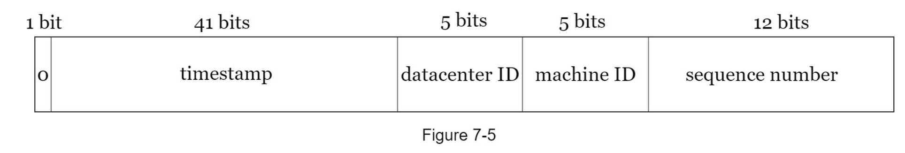

## 7. 분산 시스템을 위한 유일 ID 생성기

- 유일 ID 생성에 `auto_increment`를 사용하는건 분산 시스템에서는 불가능

### 1. 문제 이해 및 설계 범위 확정

요구사항

- ID는 유일해야한다
- ID는 숫자로만 구성되어야한다
- ID는 64비트로 표현될 수 있는 값이어야한다
- ID는 발급 날짜에 따라 정렬 가능해야한다
- 초당 10000개의 ID를 발급할 수 있어야한다

### 2. 개략적 설계안 제시 및 동의 구하기

1. 다중 마스터 복제
   - 데이터베이스의 auto_increment 기능 활용
   - 다음 ID의 값을 구할 때 1대신 K만큼 증가시킴
   - K는 현재 사용중인 데이터베이스 서버의 수
   - 단점
     - 여러 데이터센터에 걸쳐 규모를 늘리기 어렵다
     - ID 유일성은 보장되겠지만, 시간 흐름에 맞추어 커지도록 보장할 수 없다
     - 서버를 추가하거나 삭제할 때도 잘 동작하도록 만들기 어렵다
2. UUID

   - 유일성이 보장되는 ID를 만드는 간단한 방법
   - 서버 간 조율없이 독립적으로 생성 가능
   - 단점
     - 128비트로 너무 길다
     - 숫자로만 구성되어야 한다는 요구사항을 만족하지 못함
     - 발급 날짜에 따라 정렬이 불가능

3. 티켓 서버
   - 티켓 서버를 중앙 집중형으로 하나만 사용
   - 유일성이 보장되는 ID를 쉽게 만들 수 있음
   - 티켓 서버가 SPOF (Single Point of Failure)가 될 수 있음
4. 트위터 스노플레이크

   

   - 사인 비트
     - 1비트 할당
     - 나중에 음수, 양수를 구분할 때 사용가능
   - 타임스탬프
     - 41비트 할당
     - 기원 시각 이후 몇 밀리초 경과했는지 나타냄
   - 데이터센터 ID
     - 5비트 할당
     - 2^5개의 데이터센터 지원 가능
   - 서버 ID
     - 데이터센터 당 2^5개의 서버 사용 가능
   - 일련번호
     - 12비트 할당
     - ID를 생성할 때 마다 1만큼 증가시킴
     - 밀리초가 경과할 때마다 0으로 초기화 시킴

### 3. 상세 설계

- 트위터 스노플레이크 접근법
- 데이터센터 ID, 서버 ID는 시스템이 시작할 때 결정되며, 시스템 운영중에는 바뀌지 않는다
- 타임스탬프나 일련 번호는 ID 생성기가 돌고 있는 중에 만들어짐

### 4. 마무리

- 시계 동기화
  - 서버가 여러 코어에서 실행될 경우, 모두 같은 시계를 사용하는 것이 보장되지 않을 수 있음
  - NTP(Network Time Protocol)를 통해 이 문제를 해결할 수 있음
- 각 section 길이 최적화
  - 동시성이 낮고 수명이 긴 애플리케이션이라면 일련 번호 절을 줄이고, 타임스탬프 절의 길이를 늘리는 것이 효과적
- 고가용성
  - ID 생성기는 필수 불가결 컴포넌트이므로 높은 가용성 제공해야함
