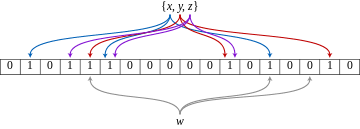

## URL 단축기 설계

### 1. 문제 이해 및 설계 범위 확정

#### 기능

- URL 단축: 주어진 긴 URL을 짧게 줄인다
- URL 리디렉션: 축약된 URL로 HTTP 요청이 오면 원래 URL로 안내
- 높은 가용성과 규모 확장성, 장애 감내

#### 개략적 추정

- 쓰기 연산: 매일 1억 개의 단축 URL 생성
- ...생략

### 2. 개략적 설계안 제시 및 동의 구하기

#### API 엔드포인트

1. URL 단축
   - POST `/api/v1/data/shorten`
   - 반환: 단축 URL
2. URL 리다이렉션
   - GET `/api/v1/shortUrl`
   - 반환: HTTP 리다이렉션 목적지가 될 원래 URL

#### 리다이렉션

- `301 Permanently Moved`

  - 영구적으로 이전되었다는 응답
  - 브라우저는 이 응답을 캐시함
  - 첫번째 요청만 단축 URL서버로 전송되므로 서버 부하를 줄일 수 있음

- `302 Found`

  - 일시적으로 Location헤더가 지정하는 URL로 이동
  - 단축 URL 서버에 먼저 보내진 후, 원래 URL로 리다이렉션
  - 트래픽 분석이 중요한 경우 유리

- `307 Temporary Redirect`

  - 302와 비슷하지만, POST 요청을 GET으로 변경하지 않음
  - 사용자의 데이터가 손실되지 않도록 하기 위한 조치
  - POST 요청을 보낼 때 사용

- `308 Permanent Redirect`
  - 301과 비슷하지만, POST 요청을 GET으로 변경하지 않음
  - POST 요청을 보낼 때 사용

#### URL 단축

- 긴 URL에 대응되는 해시 함수를 찾아야함

요구사항

- 주어진 긴 URL이 다른 값이면, 해시 값도 달라야함
- 계산된 해시 값은 원래 입력으로 주어졌던 긴 URL로 복원될 수 있어야함

### 3. 싱세 설계

- 해시 테이블의 경우 초기 전략으로는 괜찮으나, 실제 시스템으로 쓰기에는 메모리가 유한하고, 비싸서 좋지 않음
- 관계형 데이터베이스에 저장하는 방법이 있음
- <단축 URL, 원래 URL> 순서쌍

#### 해시 함수

- URL을 해시 함수에 넣어 해시값을 얻음
- 길이가 7이면 3.5조개의 URL을 저장할 수 있음

#### 해시 후 충돌 해소

- CRC32, MD5, SHA-1 등의 해시 함수를 사용하는 방법이 있음
- 세 함수 모두 결과값의 길이가 7보다는 길기때문에, 길이를 줄여야하는데
  - 처음 7개 글자만 이용하는 방법이 있음
  - 하지만 해시 결과가 충돌할 확률이 높아짐
  - 충돌이 해소 될 때까지 사전에 정한 문자열을 해시값에 덧붙임 -> 길이가 미리 정한 7보다 길어지는 건가?
  - 이 방법은 한번 이상 데이터베이스 질의를 해야하므로 오버헤드가 큼
  - 블룸 필터를 사용하면 성능을 높일 수 있음

#### 블룸필터

- 확률적인 데이터 구조
- 메모리를 적게 사용, 특정 요소의 존재 여부를 빠르게 확인할 수 있음
- 해시 함수를 사용하여 여러 개의 비트 벡터를 만들어 요소를 나타내는 것으로 동작
- 요소를 추가할 때는 해당 요소를 나타내는 비트 위치에 1을 설정
- 요소의 존재 여부를 확인할 때는 모든 해시 함수의 결과를 이용하여 비트를 검사
- 정확성은 100%가 아니지만, 메모리를 적게 사용하고 빠른 속도로 요소의 존재 여부를 확인할 수 있음

#### base62 변환

- 62진법로 변환하여 저장
- 62진법을 쓰는 이유는 hashValue에 사용할 수 있는 문자 개수가 62개이기 때문

#### 두 접근법 비교

- 해시 후 충돌 해소 전략

  - 단축 URL 길이가 고정됨
  - 유일성이 보장되는 ID 생성기가 필요치 않음
  - 충돌이 가능해서 해소 전략이 필요
  - ID로부터 단축 URL을 계산하는 방식이 아니라서 다음에 쓸 수 있는 URL을 알아내는 것이 불가능

- base-62 변환

  - 단축 URL 길이가 가변적임, 값이 커지면 길이가 길어짐
  - 유일성이 보장되는 ID 생성기가 필요함
  - ID의 유일성이 보장된 후에야 적용 가능한 전략이라 충돌은 아예 불가능
  - ID가 1씩 증가하는 값이라고 가정하면, 다음에 쓸 수 있는 URL을 알아내는 것이 가능함 (보안문제 방생 가능)

  #### URL 단축기 상세 설계

1. 입력으로 긴 url을 받는다
2. 데이터베이스에 해당 url이 있는지 검사한다
3. 데이터베이스에 있다면, 해당 URL에 대한 단축 URL을 만든 적이 있는 것. 따라서 데이터베이스에서 단축 URL을 가져와서 반환
4. 데이터베이스에 없는 경우, 새로 접수된 것이므로 유일ID를 생성하여 반환
5. 62진법 변환을 적용, ID를 단축 URL로 만든다
6. ID, 단축 URL, 원래 URL을 데이터베이스에 저장하고, 단축 URL을 반환

#### URL 리다이렉션 상세 설계

1. 사용자가 단축 URL을 클릭
2. 로드밸런서가 해당 클릭으로 발생한 요청을 웹 서버에 전달
3. 단축 URL이 이미 캐시되어있는 경우 바로 반환
4. 캐시에 단축 URL이 없는 경우, 데이터베이스에서 꺼낸다. 데이터베이스에도 없다면 사용자가 잘못 입력한 경우
5. 데이터베이스에서 꺼낸 URL을 캐시, 반환함

### 4. 마무리

- 처리율 제한 장치
- 웹 서버의 규모 확장
- 데이터베이스 규모 확장
- 데이터 분석 솔루션
- 가용성, 데이터 일관성, 안정성
