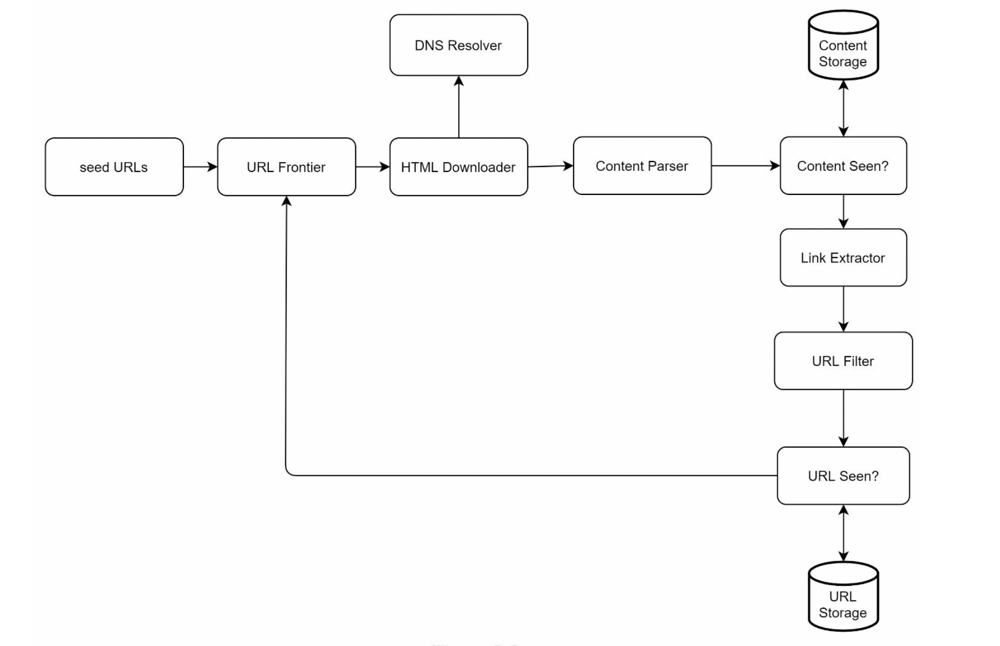
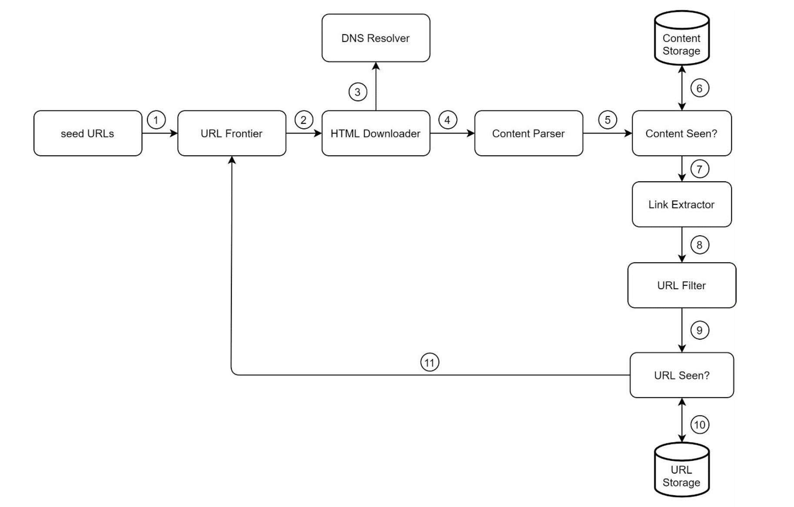
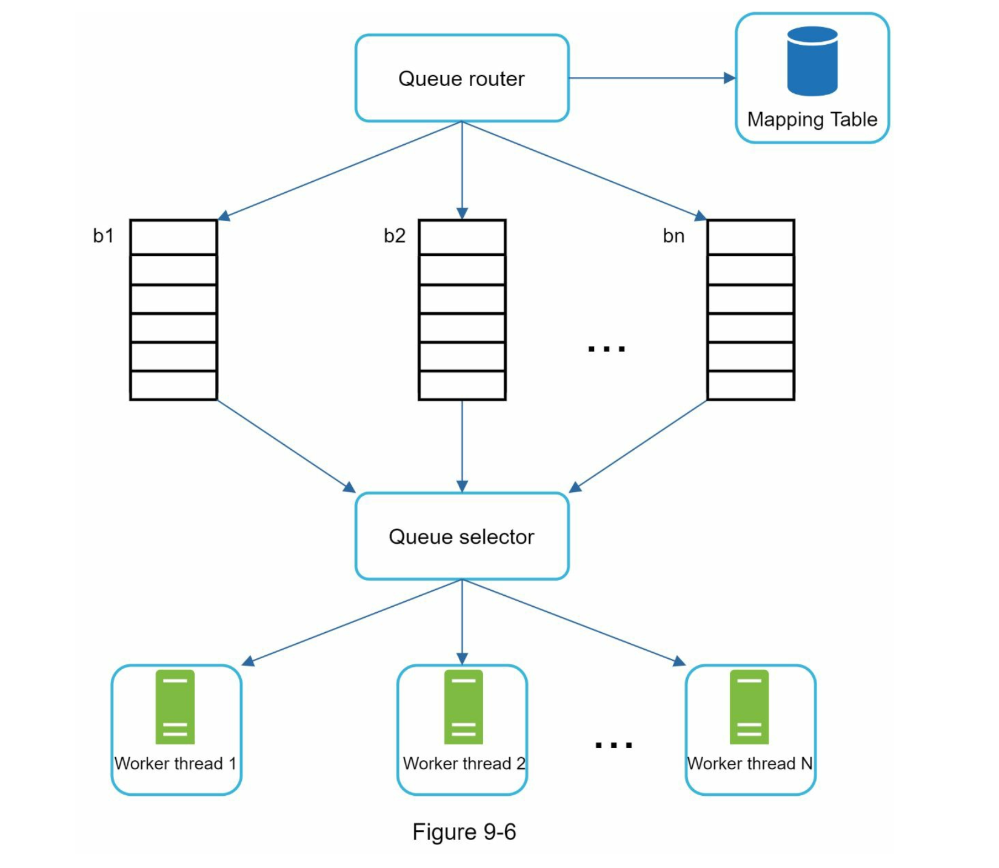
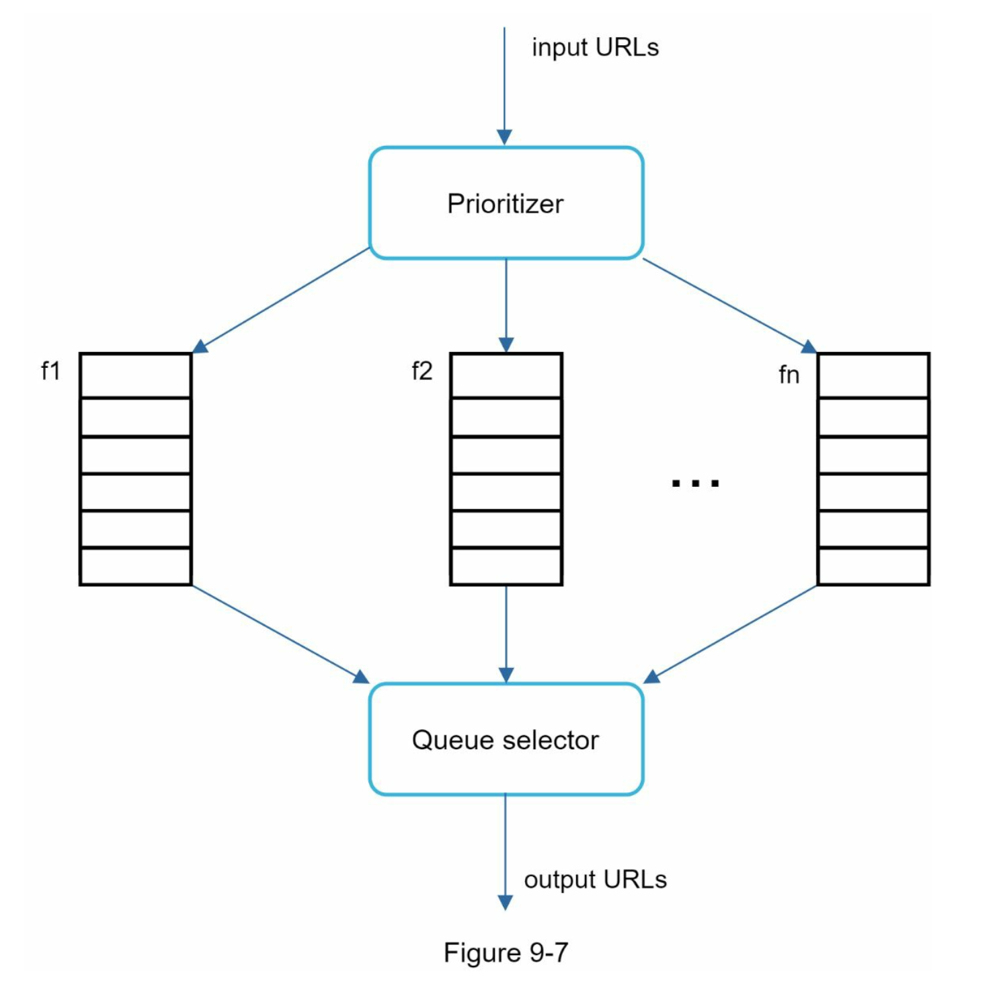
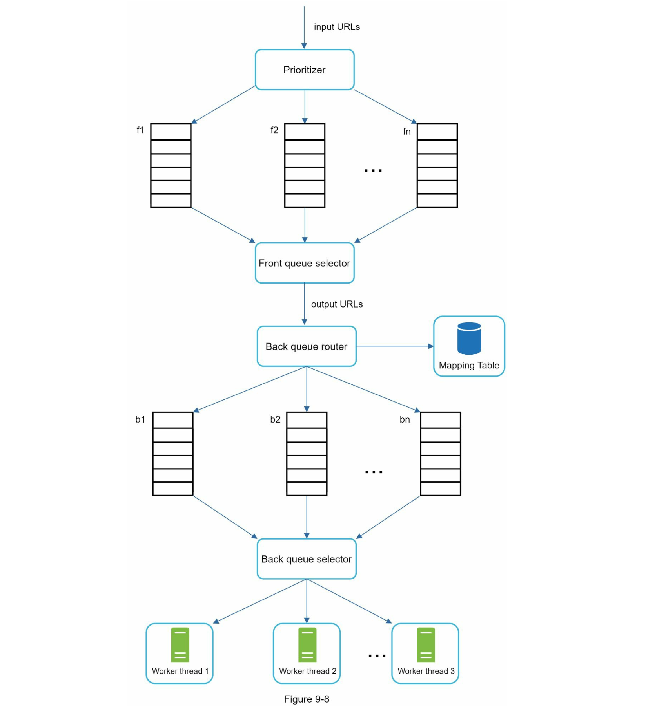
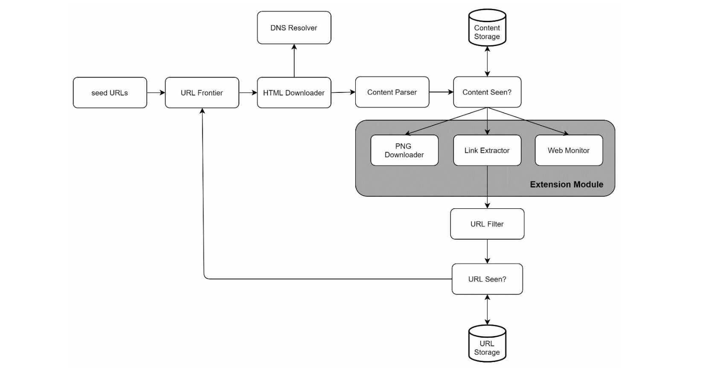

## 웹 크롤러 설계

- 웹 크롤러는 robot, spider라고도 불림
- 검색 엔진에 널리 쓰는 기술

### 크롤러가 활용되는 유형

- 검색 엔진 인덱싱: 검색 엔진을 위한 로컬 인덱스 생성 (구글 검색엔진)
- 웹 아카이빙: 나중에 사용하기 위한 목적으로 장기보관하기 위해 웹 사이트 정보를 모으는 것 (미국 국회 도서관, EU 웹 아카이브)
- 웹 마이닝: 인터넷에서 유용한 지식을 도출하기 위함
- 웹 모니터링: 저작권, 상표권 침해되는 사례 모니터링

### 1단계: 문제 이해 및 설계 범위 확정

#### 웹 크롤러의 기본 알고리즘

1. URL 집합이 입력으로 주어짐, 해당 웹 페이지들을 다운로드
2. 다운로드 받은 웹페이지에서 URL 추출
3. 추출된 URL들을 다운로드할 URL 목록에 추가, 반복

#### 설계 요구사항

- 이 예제에서 면접관이 제시한 크롤러의 용도는 검색 엔진 인덱싱
- 매달 수집해야하는 웹페이지 개수 = 10억개
- 웹 페이지의 수정, 새 웹페이지 고려 필요
- 수집한 웹페이지 5년간 저장
- 중복된 콘텐츠 무시

#### 웹 크롤러가 만족해야하는 속성

- 규모 확장성: 분산처리
- 안정성: 비정상적인 상황에 대응
- 예절: 짧은 시간동안 동일 웹사이트에 너무 많은 요청을 보내지 않음
- 확장성: 새로운 형태의 콘텐츠를 지원하기 쉬워야함

#### 개략적 규모 추정

- 매달 10억개의 웹페이지 다운로드
- 초당 쿼리 수(QPS) = 400페이지 / 초
- 최대 QPS = 2xQPS = 800
- 웹페이지 크기 평균은 500,000으로 가정
- 1개월치 데이터를 보관하는데 500TB, 5년관 보관하므로 300PB 필요

### 2단계: 개략적 설계안 제시 및 동의 구하기

#### 시작 URL 집합

- 웹 크롤러가 크롤링을 시작하는 출발점
- 전체 웹을 크롤링 해야하는 경우, 크롤러가 가능한 많은 링크를 탐색할 수 있도록 URL을 골라야함
- 나라별 인기있는 URL, 주제별 URL 등

#### 미수집 URL 저장소

- 크롤링 상태는 1) 다운로드할 URL, 2) 다운로드 된 URL 로 나뉨
- 다운로드할 URL을 저장 관리하는 컴포넌트를 미수집 URL 저장소라고함
- FIFO 큐로 생각하면 됨

#### HTML 다운로더

- 웹 페이지를 다운로드 하는 컴포넌트

#### 도메인 이름 변환기

- 웹 페이지를 다운받으려면 URL 주소를 IP로 변환하는 절차 필요 (?)

#### 콘텐츠 파서

- 웹 페이지를 다운로드 하면, 파싱, 검증 절차를 거쳐야함
- 이상한 웹페이지는 문제를 일으킬 수 있고, 저장공간만 낭비
- 크롤링 서버 안에 콘텐츠 파서를 두면 크롤링 과정이 느려질 수 있으므로, 독립된 컴포넌트로 만듦

#### 중복 콘텐츠인가?

- 보통 29%의 웹페이지 콘텐츠는 중복임
- 자료구조(해시 테이블 등)를 도입하여 데이터 중복을 줄이고, 데이터 처리에 소요되는 시간 줄
- HTML로 비교하면 느리고 비효율적이므로, 웹페이지 해시 값을 비교하는 방법이 좋음

#### 콘텐츠 저장소

- HTML 문서를 보관하는 시스템
- 디스크, 메모리를 동시에 사용하는 저장소를 택함
- 데이터 양이 많으므로 대부분의 콘텐츠는 디스크에 저장
- 인기있는 콘텐츠는 메모리에 두어 접근 지연시간 줄임

#### URL 추출기

- HTML 페이지를 파싱하여 링크를 골라냄
- 상대경로는 절대경로로 변환

#### URL 필터

- 특정 콘텐츠 타입이나 파일 확장자를 갖는 URL, 접속 시 오류가 발생하는 URL, 접근 제외 목록에 포함된 URL 을 크롤링 대상에서 배제

#### 이미 방문한 URL

- 이미 방문한 URL이나, 미수집 URL 저장소에 보관된 URL을 추적할 수 있는 자료구조 사용
- 자료 구조로는 블룸 필터, 해시 테이블이 주로 사용됨
- 블룸 필터의 경우 이미 방문한 URL을 블룸 필터에 추가함.
  - 메모리 사용량 적음
  - 빠르게 URL이 이미 저장소에 있는지 확인 가능
  - 실제로 방문하지 않은 URL을 이미 방문한 것으로 판단할 수 있음
- 해시테이블로 URL을 Key, 방문여부를 value로 사용 가능
  - 메모리 사용량이 더 많음
  - 정확한 방문 여부 판단 가능

#### URL 저장소

- 이미 방문한 URL을 보관하는 저장소

#### 웹 크롤러 작업 흐름

1. 시작 URL 을 미수집 URL 저장소에 저장
2. HTML 다운로더는 미수집 URL 저장소에서 URL 목록을 가져옴
3. HTML 다운로더는 도메인 이름 변환기를 사용하여 URL의 IP 주소를 알아내고, 해당 IP 주소로 접속해서 웹페이지 다운
4. 콘텐츠 파서는 다운된 HTML 페이지를 파싱해서 올바른 현식을 갖춘 페이지인지 검증
5. 콘텐츠 파싱, 검증 후 중복콘텐츠인지 확인하는 절차 가짐
6. 중복 콘텐츠인지 확인하기 위해 해당 페이지가 이미 저장소에 있는지 확인
   - 이미 저장소에 있는 콘텐츠인 경우 처리하지 않고 버림
   - 저장소에 없는 콘텐츠는, 저장소에 저장하고 URL 추출기로 전달
7. URL 추출기는 해당 HTML 페이지에서 링크 골라냄
8. 골라낸 링크를 URL 필터로 전달
9. 필터링 끝나고 남은 URL만 중복 URL 판별 단계로 전달
10. 이미 처리한 URL인지 확인하기 위해 URL 저장소에 보관된 URL인지 확인하고, 이미 저장소에 있는 URL 버림
11. 저장소에 없는 URL은 URL 저장소에 저장하고, 미수집 URL 저장소에도 전달

### 3단계: 상세 설계

- DFS
- 미수집 URL 저장소
- HTML 다운로더
- 안정성 확보 전략
- 확장성 확보 전략
- 문제 있는 콘텐츠 감지 및 회피 전략

#### DFS vs BFS

- DFS를 사용할 경우, 그래프 크기가 클 경우 깊이가 얼마나 될지 가늠하기 어려움
- 보통 웹 크롤러는 BFS 사용함
- BFS는 FIFO 큐를 사용하는 알고리즘

##### 문제점

- 한 페이지에서 나오는 상당 수의 링크는 같은 서버로 되돌아감
- 한번에 같은 서버로 요청을 보내게됨 -> 예의 없는 크롤러로 간주됨
- 표준 BFS 알고리즘은 URL 간에 우선순위 두지 않음
- 하지만 웹 페이지는 같은 수준의 품질, 중요성을 가지지 않기때문에 우선순위를 구별하는 것이 좋음

#### 미수집 URL 저장소

- 다운로드할 URL을 보관하는 장소
- 예의 갖춘 크롤러, URL 사이의 우선순위와 신선도를 구별하는 크롤러 구현할 수 있음

##### 예의

- 수집 대상 서버로 짧은 시간 안에 너무 많은 요청을 보내면 무례함
- DoS 공격으로 간주되기도 함
- 초당 수천 건의 페이지 요청을 동일한 웹 사이트로 보내면, 사이트가 마비될 수도 있음
- 예의 바른 크롤러를 만드는 원칙은, 동일 웹 사이트에 대해서 한번에 한 페이지만 요청해햐함
- 같은 웹 사이트의 페이지를 다운받는 태스크는 시간차를 두고 실행하도록 하면됨
- -> 웹 사이트 호스트명과 다운로드를 수행하는 작업 스레드 사이의 관계를 유지하면 됨
- -> 각 다운로드 스레드는 별도의 FIFO 큐를 가지고 있어서, 해당 큐에서 꺼낸 URL만 다운로드

##### 설계

- 큐 라우터: 같은 호스트에 속한 URL은 언제나 같은 큐로 가도록 보장하는 역할
- 매핑 테이블: 호스트이름과 큐 사이의 관계를 보관하는 테이블
- FIFO 큐: 같은 호스트에 속한 URL은 언제나 같은 큐에 보관됨
- 큐 선택기: 큐들을 순회하면서 큐에서 URL을 꺼내서 해당 큐에서 나온 URL을 다운로드하도록 지정된 작업 스레드에 전달
- 작업 스레드: URL을 다운로드. 순차적으로 처리되고, 작업들 사이에 일정 지연시간 둘 수 있음

##### 우선순위

- 유용성에 따라 우선순위를 나눌 때는 페이지랭크, 트래픽 양, 갱신 빈도 등의 척도를 사용할 수 있음
- 순위 결정 장치는 URL 우선순위를 정함

- 순위 결정장치: URL을 입력으로 받아 우선순위 계산
- 큐: 우선순위별로 큐가 하나씩 할당됨
- 큐선택기: 임의 큐에서 처리할 URL을 꺼내는 역할 담당
- 순위가 높은 큐에서 더 자주 꺼내도록 프로그램 되어있음

- 전먼 큐: 우선순위 결정 과정을 처리
- 후면 큐: 크롤러가 예의 바르게 동작하도록 보증

##### 신선도

- 이미 다운로드 된 페이지라고 해도 주기적으로 재수집할 필요 있음
- 웹 페이지의 변경 이력 활용
- 우선순위 활용하여 중요한 페이지는 좀더 자주 재수집

##### 미수집 URL 저장소를 위한 지속성 저장장치

- 모든 데이터를 디스크에 저장하면 쉽게 성능 병목지점이 됨
- 절충안은, 대부분의 URL을 디스크에 두고, IO 비용을 줄이기 위해 메모리 버퍼에 큐를 두는 것. 버퍼에 있는 데이터는 주기적으로 디스크에 기록

##### HTML 다운로더

###### 로봇 제외 프로토콜

- Robots.txt
- 크롤러가 수집해도 되는 페이지 목록이 들어있음
- Robots.txt 파일을 여러번 다운로드 하는 것을 피하기 위해 주기적으로 다시 다운로드 받아 캐시에 보관함

###### 성능 최적화

1. 분산 크롤링
2. 도메인 이름 변환 결과 캐시
3. 지역성
4. 짧은 타임아웃

###### 안정성

- 안정 해시: 다운로더 서버들에 부하를 분산할 때 적용 가능한 기술. 다운로더 서버를 쉽게 추가, 삭제할 수 있음
- 크롤링 상태 및 수집 데이터 저장: 장에 대비
- 예외 처리
- 데이터 검증

###### 확장성

- PNG 다운로더
- 웹 모니터: 저작권, 상표권 침해 사례 모니터링

###### 문제 있는 콘텐츠 감지 및 회피

1. 중복 콘텐츠: 해시, 체크섬을 사용
2. 거미 덫
   - 크롤러를 무한 루프에 빠뜨리도록 설계된 웹 페이지
   - 덫으로 확인된 페이지는 URL 필터 목록에 추가해두는 방법이 있음 (수동)
3. 데이터 노이즈

### 4단계 마무리

추가로 논의해보면 좋을 점

- 서버 측 렌더링
  - 동적으로 렌더링 되는 페이지를 크롤링하기 위함
- 원치 않는 페이지 필터링
  - 스팸 방지 컴포넌트
- 데이터베이스 다중화 및 샤딩
- 수평적 규모 확장성
- 가용성, 일관성, 안정성
- 데이터 분석 솔루션
