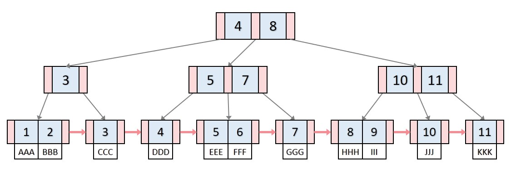

## Tree

노드로 이루어짐. 그래프의 한 종류

### 특징

- 방향 그래프
- 사이클 불가능
- 자체 간선 불가능
- 하나의 루트 노드를 가짐
- 0개 이상의 자식 노드를 가짐
- 계층 모델
- 이진 트리, 이진 탐색 트리, 균형 트리, 이진 힙 등

### 이진 힙 (Binary Heap)

- 힙은 트리 기반 자료구조, 힙 속성을 만족하는 거의 완전한 트리
- 힙 속성: 최대힙의 경우 부모 노드는 반드시 자식 노드보다 값이 커야하는 것, 최상위 노드는 최댓값
- 완전 이진 트리 조건을 만족해야함

### 레드 블랙 트리 (Red-Black Tree)

자가 균형 이진 탐색 트리

#### 조건

- 노드는 빨간색 혹은 검은색
- 루트 노드는 검은색
- 모든 리프 노드는 검은색
- 빨간색 노드의 자식은 검은색
- 모든 리프 노트에서 black depth는 같음 (=리프 노드에서 루트 노드까지 가는 경로에서 만나는 검은색 노드의 수가 같음)

### B+ 트리

- 루트 노드, 브랜치 노드, 리프 노드로 나뉨
- 리프 노드만 데이터를 가지고 있고, 그 외에는 key만 가지고 있음
- 모든 리프 노드는 연결리스트 형태 (순차 검색에 유리)

#### 참고자료

https://gmlwjd9405.github.io/2018/08/12/data-structure-tree.html
https://kayuse88.github.io/binary-heap/
https://code-lab1.tistory.com/62ㄱ
https://velog.io/@emplam27/%EC%9E%90%EB%A3%8C%EA%B5%AC%EC%A1%B0-%EA%B7%B8%EB%A6%BC%EC%9C%BC%EB%A1%9C-%EC%95%8C%EC%95%84%EB%B3%B4%EB%8A%94-B-Plus-Tree
