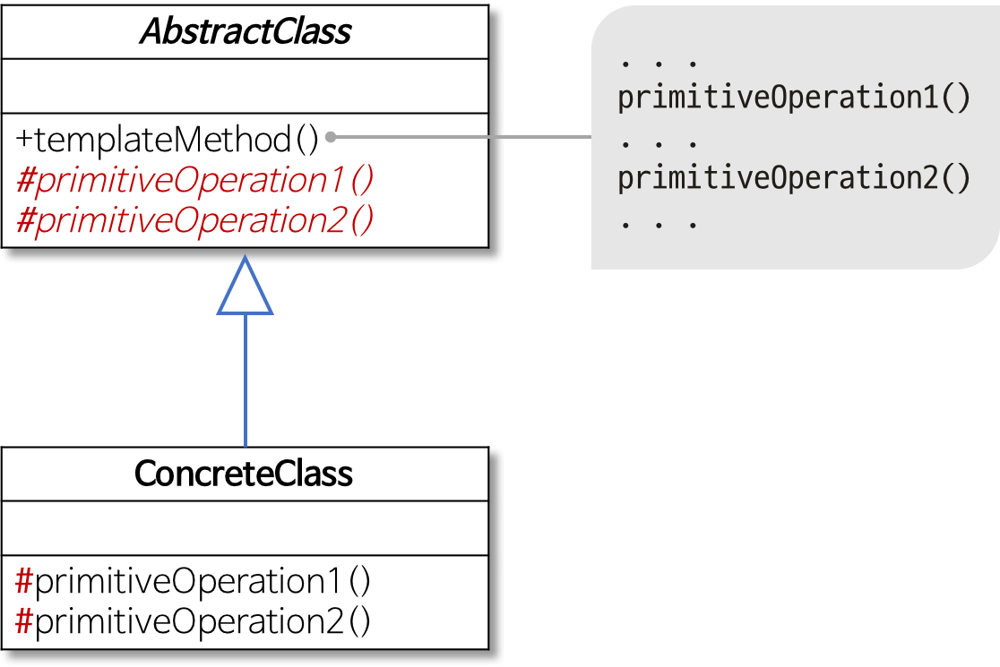

## 템플릿 메서드 패턴 (Template Method Pattern)

- 어떤 작업을 처리하는 일부분을 서브 클래스로 캡슐화
- 전체적으로는 동일하면서 부분적으로 다른 구문으로 구성된 코드 중복을 최소화할 때 유용
- 동일한 기능은 상위 클래스에서 구현하고, 확장/변화가 필요한 부분만 서브 클래스에서 구현할 수 있음

- Abstract Class에서 템플릿 메서드를 정의
- 하위 클래스에서 구현될 기능을 primitive메서드 또는 hook메서드로 정의
- ConcreteClass에서 primitive메서드 또는 hook메서드 구현

### 예제

깃허브 참고

#### 참고자료

https://gmlwjd9405.github.io/2018/07/13/template-method-pattern.html
