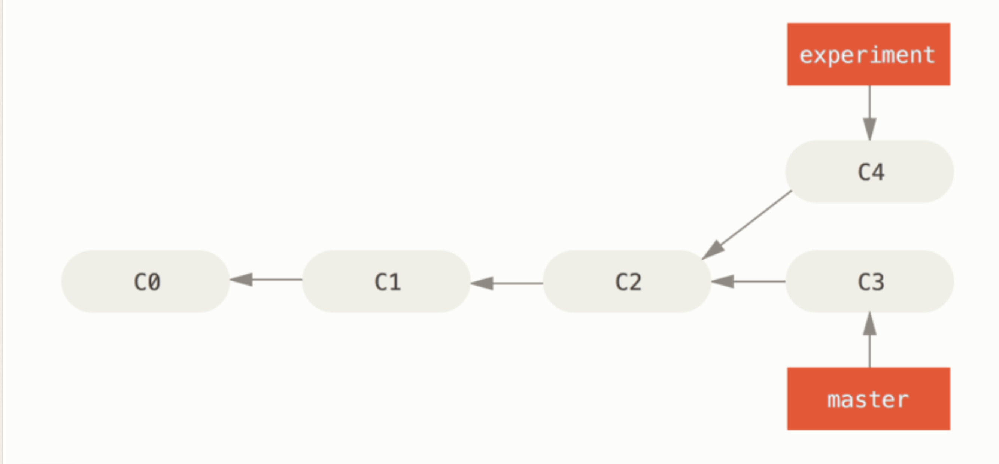
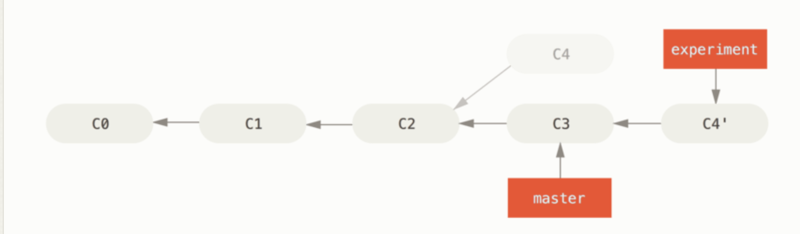

## Rebase

### 개념, 특징

- merge와 마찬가지로 변경사항을 브랜치에 통합하는데 사용됨
- 두 개의 공통 base를 가진 branch의 base를 다른 branch의 최신 커밋으로 base를 옮기는 것
- base를 다시 설정하는 것
- git flow를 예로들면, feature 브랜치에 작업하다가, develop브랜치에 업데이트가 있는 경우
  - merge로 받아오면 commit history가 복잡해짐
  - commit 그래프가 복잡해짐 - 엄청 많은 feature 브랜치가 작업된다면? 많은 커밋 가닥이 생기게됨
  - rebase를 사용하면, 최신 버전을 가져와서 base를 새로 설정하게되어 커밋 그래프가 깔끔해짐

rebase 전

rebase 후


### 사용법

- 작업브랜치인 experiment 브랜치로 이동
- experiment브랜치의 base를 master 브랜치의 최신 커밋으로 변경

```bash
git checkout experiment
git rebase master
```

### 단점

- merge는 conflict를 한번만 해결해주면 되는데, rebase는 모든 커밋마다 해결해주어야함 (오히려 장점이라고 하기도함)

### 참고자료

https://seosh817.tistory.com/240
