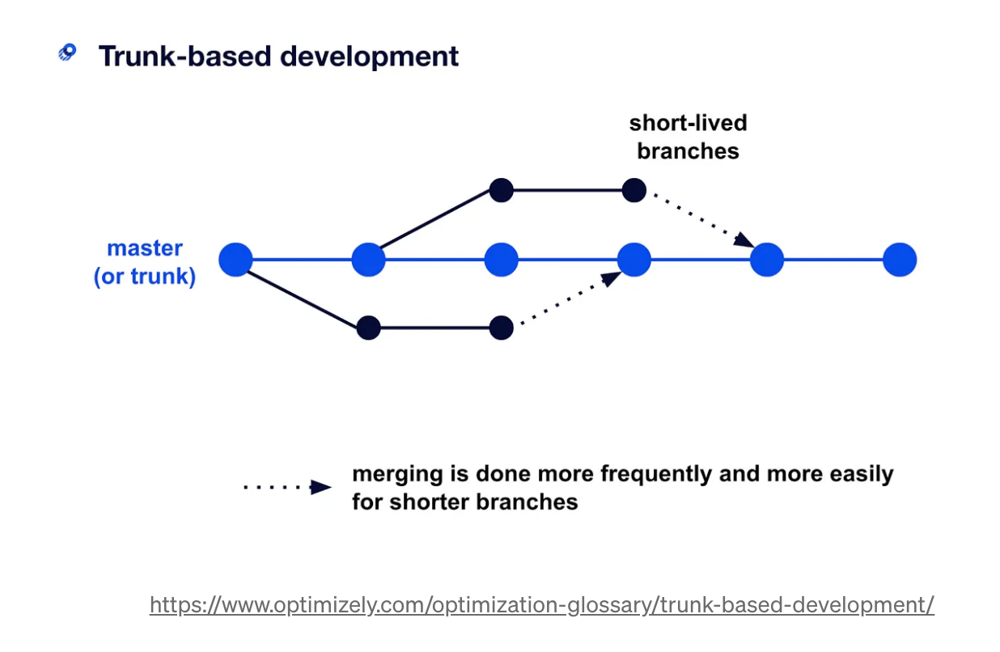

## Trunk-Based Development Branch 전략

### 사용 이유

- mono repo 프로젝트에서 주로 채택

### 개념

- 항상 릴리즈 가능 상태인 trunk (master)가 있음 (항상 올바른 상태여야함)
- 바로 하위로 Feature 브랜치를 따서 작업하는 형태
- 모든 개발자가 최상위 브랜치에 집중하게 되면서, 많은 프로젝트의 align을 맞추기 쉬움

### 지켜야할 것

- 작은 단위로 feature 작업을 진행할 것 (긴 작업 단위의 브랜치 생성을 피함)
- 주기적인 CI/CD로 빌드 문제가 발생하지 않도록 할 것

### 배포 방법

- 배포는 직접 배포 혹은 브랜치 배포로 진행
- 직접 배포 : 마스터에서 바로 배포를 수행
- 브랜치 배포 : 마스터에서 필요 시점에 배포 브랜치를 생성 후 배포를 수행
- 배포 브랜치에서 작업한 결과는 마스터로 머지하지 않음
- 배포 브랜치에서 추가 작업이 필요할 경우 마스터에서 작업을 수행 후 해당 커밋을 체리픽하여 가져옴
- 운영, 개발 서버에 동시 배포

#### 참고자료

- https://blog.mathpresso.com/%ED%8C%80%EC%9B%8C%ED%81%AC-%ED%96%A5%EC%83%81%EC%9D%84-%EC%9C%84%ED%95%9C-%EB%AA%A8%EB%85%B8%EB%A0%88%ED%8F%AC-monorepo-%EC%8B%9C%EC%8A%A4%ED%85%9C-%EA%B5%AC%EC%B6%95-3ae1b0112f1b
  https://tech.buzzvil.com/handbook/workingflow-in-monorepo/
