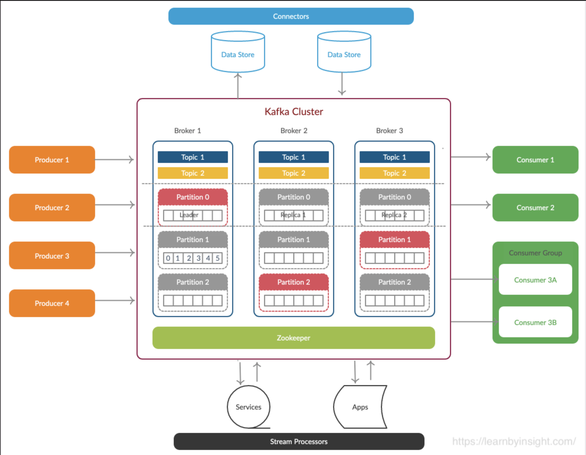

## Kafka

고성능 분산 이벤트 스트리밍 플랫폼

- pub, sub 형태의 메시지 큐 형태로 동작
- 분산 환경에 특화

### 구성요소



#### Topic

- 각 메세지를 목적에 맞게 구분할 때 사용
- 메세지를 전송하거나 소비할 때 무조건 입력
- Consumer는 자신이 담당하는 Topic의 메세지를 처리
- 한 개의 토픽은 한 개 이상의 파티션으로 구성

#### Partition

- 분산처리를 위해 사용됨
- Topic생성 시 partition 개수를 지정할 수 있음 (partition 추가 가능)
- 파티션이 1개라면 모든 메세지의 순서가 보장됨
- 파티션 내부에서 각 메세지는 offset으로 구분됨
- 파티션이 여러개라면 kafka클러스터가 라운드 로빈 방식으로 분배해서 분산처리되기때문에 순서가 보장되지 않음
- 파티션이 많을 수록 처리량이 좋지만 장애 복구 시간이 늘어남

#### Offset

- 컨슈머에서 메세지를 어디까지 읽었는지 저장하는 값
- 컨슈머 그룹의 컨슈머들은 각각의 파티션에 자신이 가져간 메세지의 위치 정보를 기록
- 컨슈머 장애 발생 후 다시 살아나도, 전에 마지막으로 읽었던 위치에서부터 다시 읽어들일 수 있음

#### Producer

- 메세지를 만들어서 카프카 클러스터에 전송
- 메세지전송 시 Batch 처리 가능
- key 값을 지정하여 특정 Partition으로만 전송이 가능함
- 전송 acks값을 설정하여 효율성을 높일 수 있음
- ACKS = 0 -> 매우 빠르게 전송, 파티션 리더가 받았는지 알 수 없음
- ACKS = 1 -> 리더가 받았는지 확인. 기본값
- ACKS = ALL -> 리더와 팔로워가 받았는지 확인

#### Consumer

- 카프카 클러스터에서 메세지를 읽어서 처리
- 메세지를 Batch로 읽어들일 수 있음
- 한개의 컨슈머는 여러 개의 토픽을 처리할 수 있음
- 메세지를 소비해도 메세지를 삭제하지는 않음
- 한번 저장된 메세지를 여러번 소비하는 것도 가능
- 컨슈머는 컨슈머 그룹에 속함
- 한개 파티션은 같은 컨슈머 그룹의 여러개의 컨슈머에서 연결할 수 없음
    - 한 파티션 내에서는 순서 보장이 되어야하므로, 여러 컨슈머가 읽으면 동시성 문제 있을 수 있음

#### Broker

- 실행된 카프카 서버
- 프로듀서와 컨슈머는 별도의 애플리케이션으로 구성되는 반면, 브로커는 카프카 그자체
- 브로커는 카프카 클러스터 내부에 존재함
- 서버 내부에 메세지를 저장하고 관리하는 역할 수행

#### Zookeeper

- 분산 애플리케이션 관리를위한 코디네이터 시스템
- 분산 메세지 큐의 메타 정보를 중앙에서 관리하는 역할
- kafka가 분산시스템이기때문에 여러 브로커(카프카 서버)들이 누가 리더인지, 어떤 토픽이 어디에 저장되는지 알아야함. 이 역할을 주키퍼가 수행함
- 쉽게 말해서 브로커를 관리하는 역할
- 리더 브로커가 죽으면 다른 브로커를 리더로 선출하는 등의 역할을 함
- 컨슈머 그룹 관리 역할도 함
  - 어떤 컨슈머 그룹이 어떤 파티션을 읽을지 결정
- 토픽 관리
- 2.8부터 주키퍼 없이 운영하는 모드 지원
- 3.3부터는 완전한 주키퍼 제거 가능
- 대규모 운영에서는 여전히 주키퍼 사용하는 경우 많음

### 메시지 전송 방식

#### at-most-once

- 최대 1회, 중복 없음
- 메세지 유실 가능성 있음
- 속도, 성능 좋음

#### at-least-once

- 최소 1회, 중복 있음
- 메세지 유실 없음
- 대부분의 사용하는 방법

#### exactly-once

- 정확히 1회, 중복 없음
- 트랜잭션 기능 활용하여 처리
- 트랜잭션 유지 비용 발생

### Replication
- 데이터를 여러 서버에 복제해서 데이터 손실을 방지하고 내구성 보장
- 각 파티션은 하나 이상의 복제본 가질 수 있음
- 복제본은 데이터 리더가 쓰기/읽기 작업을 하고, 팔로워는 리더의 데이터를 복제해서 백업함
- 고가용성, 데이터 복구 용이

### Kafka 사용해보기
1. docker-compose 설정
    ```yaml
    version: '2'
    services:
    zookeeper:
        image: wurstmeister/zookeeper:3.4.6
        container_name: zookeeper
        ports:
        - "2181:2181"
        environment:
        ZOOKEEPER_ADMINSERVER: "yes"
        ZOOKEEPER_CLIENT_PORT: 2181

    kafka:
        image: wurstmeister/kafka:latest
        container_name: kafka
        ports:
        - "9093:9093"
        - "9094:9094"
        environment:
        KAFKA_ADVERTISED_LISTENERS: INSIDE://kafka:9093,OUTSIDE://localhost:9094
        KAFKA_LISTENER_SECURITY_PROTOCOL: PLAINTEXT
        KAFKA_LISTENER_NAME_INSIDE: INSIDE
        KAFKA_LISTENER_NAME_OUTSIDE: OUTSIDE
        KAFKA_LISTENERS: INSIDE://0.0.0.0:9093,OUTSIDE://0.0.0.0:9094
        KAFKA_ZOOKEEPER_CONNECT: zookeeper:2181
        KAFKA_LISTENER_SECURITY_PROTOCOL_MAP: INSIDE:PLAINTEXT,OUTSIDE:PLAINTEXT
        KAFKA_LISTENER_NAMES: INSIDE,OUTSIDE
        KAFKA_LISTENER_PORTS: 9093,9094
        KAFKA_LISTENER_NAME_OUTSIDE_PORT: 9094
        KAFKA_INTER_BROKER_LISTENER_NAME: INSIDE  # 이 줄을 추가
        depends_on:
        - zookeeper
    ```
2. docker-compose 실행
    ```bash
    docker-compose up -d
    ```
3. 토픽 생성
    ```bash
    docker exec -it <kafka-container-id> kafka-topics.sh --create --topic test-topic --bootstrap-server localhost:9093 --partitions 1 --replication-factor 1
    ```
4. 토픽 확인
    ```bash
    docker exec -it kafka kafka-topics.sh --list --bootstrap-server kafka:9093
    ```
5. 토픽에 메세지 보내기 (producer)
    ```bash
    docker exec -it kafka kafka-console-producer.sh --broker-list kafka:9093 --topic test-topic
    ```
6. 토픽에서 메세지 읽기 (consumer)
    ```bash
    docker exec -it kafka kafka-console-consumer.sh --bootstrap-server kafka:9093 --topic test-topic --from-beginning
    ```
7. 토픽 설정 확인
    ```bash
    docker exec -it kafka kafka-topics.sh --describe --topic test-topic --bootstrap-server kafka:9093
    ```

#### 참고자료

- [블로그](https://velog.io/@holicme7/Apache-Kafka-%EC%B9%B4%ED%94%84%EC%B9%B4%EB%9E%80-%EB%AC%B4%EC%97%87%EC%9D%B8%EA%B0%80)
- GPT
