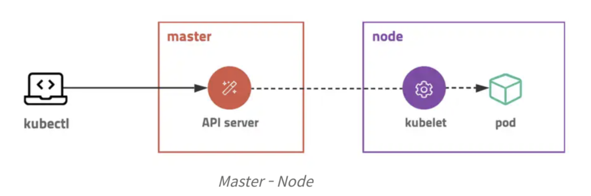

## Kubernetes

컨테이너 관리를 자동화하는 도구 (컨테이너 오케스트레이션)

- 컨테이너화된 워크로드와 서비스를 관리하기 위한 이식성있고 확장가능한 오픈소스 플랫폼
- 선언적 구성과 자동화를 용이하게해줌

### 쿠버네티스가 필요한 이유

- 프로덕션 환경에서는 어플리케이션을 실행하는 컨테이너를 관리하고 가동중지 시간이 없는지 확인해야함
- 컨테이너가 다운되면 다른 컨테이너를 다시 시작해야함
- 이런 문제를 시스템을 이용하여 처리할 수 있게함

### 특징

- 여러 배포 방식을 지원함
- 네임스페이스 기능으로, 여러 컨테이너를 논리적으로 구분하여 사용할 수 있음
- 라벨 기능으로 유연하고 확장성있게 리소스 관리

### RBAC (role based access control)

- 역할 기반 엑세스 제어
- 누가 무엇을 어디에 실행할 수 있는지 결정하는 권한 또는 템플릿 집합을 수반하는 identity 및 엑세스 관리 형식
- AWS의 경우 IAM과 연동

### Auto Scailing

- 손쉽게 리소스 확장 가능
- Horizontal Pod Autoscaler (HPA)를 이용하여 CPU 사용량, 메모리 사용량 등을 기준으로 자동으로 Pod 수평확장 가능
- Vertical Pod Autoscaler (VPA)를 이용하여 Pod의 리소스 할당량을 자동으로 조정
- Cluster AutoScailing (CA)를 이용하여 노드의 수를 자동으로 조정 (클라우드 환경에서)

### Federation, Multi-Cluster

- 클라우드에 설치한 쿠버네티스 클러스터와 자체서버에 설치한 쿠버네티스 클러스터를 묶어서 하나로 사용가능
- 구글의 Anthos를 사용하면 여러 클러스터를 하나로 관리가능

### 단점

- 복잡한 설정이 필요함
- 러닝커브가 높음

### 기본 개념, 구성 요소



- 마스터-노드 구조
- 중앙 (마스터)에 API 서버와 상태 저장소를 두고 각 서버 (node)의 에이전트 (kubelet)와 통신하는 구조
- Kubectl이라는 Client도구로 API 서버 접근
- 관리자가 서버를 배포할 때 직접적인 동작을 명령하지 않고, 원하는 상태를 선언하는 방식을 사용
- Run X, Create O

  > “nginx 컨테이너를 실행해줘. 그리고 80 포트로 오픈해줘.”
  > -> 현재 상태를 원하는 상태로 바꾸기 위한 명령(imperative)
  > “80 포트를 오픈한 nginx 컨테이너를 1개 유지해줘”
  > -> 원하는 상태를 선언(declarative)

- Desired State
  - 관리자가 원하는 환경
  - 현재 상태를 모니터링하면서, 관리자가 원하는 상태를 유지하는 방향으로 동작
- 쿠버네티스의 핵심은 상태이고, 어떤 상태가 있고, 어떻게 상태를 선언하는지 알아야함

### Object

#### Pod

- 쿠버네티스에서 배포할 수 있는 가장 작은 단위
- 한 개 이상의 컨테이너, 네트워크, 스토리지 가짐
- 컨테이너를 하나만 사용하는 경우에도 Pod로 배포

#### ReplicaSet & Deployment

- Pod를 여러개 복제하여 관리하는 오브젝트
- 복제할 개수, 개수를 체크할 라벨 선택자, Pod 템플릿을 가짐
- 자동으로 롤링업데이트 가능

#### Service

- 네트워크 관련 Object
- Pod <-> Pod 연결, 외부에서 접근할 때 등 사용

### Kubernetes Object Spec - Manifest 파일

- 오브젝트의 명세 Spec, 상태 Desired state 정의는 yaml 파일로 정의
- 오브젝트의 종류와 원하는 상태 입력
- 배포 노드 설정이나 RBAC (권한 설정) 도 가능

#### 예시 - nginx pod 3개를 배포하는 manifest

```yaml
apiVersion: apps/v1
kind: Deployment
metadata:
  name: nginx
  namespace: dev
spec:
  replicas: 3
  selector:
    matchLabels:
      app: nginx
  template:
    metadata:
      labels:
        app: nginx
    spec:
      containers:
        - name: nginx
          image: nginx:latest
          command: ["/bin/bash", "-c", "--"]
          args: ["while true; do sleep 30; done;"]
          ports:
            - containerPort: 80
```

#### 참고자료

- https://kubernetes.io/ko/docs/concepts/overview/
- https://velog.io/@holicme7/K8s-%EC%BF%A0%EB%B2%84%EB%84%A4%ED%8B%B0%EC%8A%A4%EB%9E%80-%EB%AC%B4%EC%97%87%EC%9D%B8%EA%B0%80

#### 찾아볼 것

- 롤링 업데이트
- Pod
