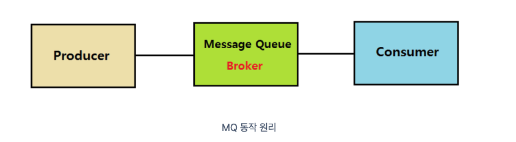

## 메세지 큐

- 메세지 지향 미들웨어를 구현한 시스템
- 프로그램 간의 데이터를 교환할 때 사용
- producer: 정보를 제공하는 자
- consumer: 정보를 소비하는 자
- queue: producer의 데이터를 임시 저장 및 consumer에게 전달

### 장점

- 비동기 통신 가능
- queue라는 임시 저장소가 있기때문에 나중에 처리 가능
- 애플리케이션 간 낮은 결합도
- 확장성
- 탄력성: consumer가 다운되어도, 데이터가 queue에 남아있기 때문에 데이터 손실이 없음
- 보장성: 데이터가 queue에 들어가면, 반드시 consumer에게 전달됨

### 메세지 브로커

- pub이 생성한 메세지를 queue에 저장하고, consumer가 가져갈 수 있도록 중간다리 역할을 해주는 브로커
- 예) Redis, RabbitMQ, AWS SQS, GCP pubsub
- consumer가 데이터를 가져가고 나면, 빠른 시간 내에 큐에 데아터가 삭제되는 특성을 가짐

### 이벤트 브로커

- 기본적으로 메세지 브로커의 역할도 할 수 있음
- pub이 생성한 메세지를 처리 후 바로 삭제하지 않고 따로 저장하여 이벤트 시점이 저장됨
- consumer가 특정 시점에 다시 이벤트를 consume할 수 있는 장점이 있음
- 메세지 브로커보다 더 많은 양의 데이터를 처리할 수 있음
- 예) kafka, AWS Kinesis

#### 참고자료

[link](https://velog.io/@holicme7/Apache-Kafka-%EC%B9%B4%ED%94%84%EC%B9%B4%EB%9E%80-%EB%AC%B4%EC%97%87%EC%9D%B8%EA%B0%80)
