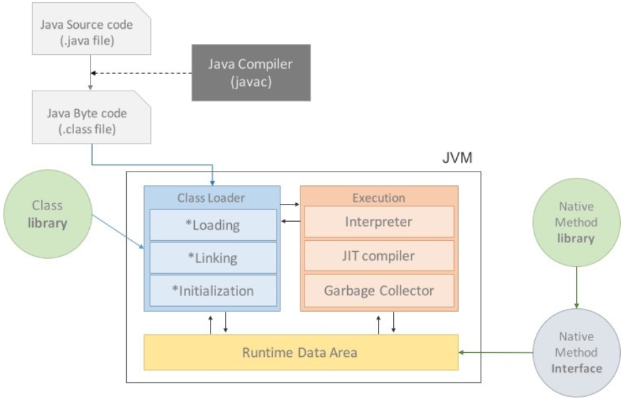

## JVM

OS에 종속받지 않고 CPU가 자바를 인식, 실행할 수 있게 하는 가상 기계이다.

### 컴파일

`.java` 코드를 Java Compiler를 통해 JVM이 인식할 수 있는 `.class`로 변경한다. .class로 변환된 코드를 자바 바이트 코드라고함
자바 바이트 코드는 인터프리터 또는 JIT 컴파일러에 의해 바이너리 코드로 변환됨

### 구조

#### 클래스 로더 (Class Loader)

JVM 내로 .class 파일을 로드하고, 링크를 통해 배치하는 작업을 수행함

#### 실행 엔진(Execution)

클래스를 실행시킨다. .class 코드를 기계가 실행할 수 있는 형태로 변경

#### 인터프리터

실행 엔진은 자바 바이트 코드를 명령어 단위로 읽어서 실행함
하지만 한줄씩 수행하기 때문에 느리다른 단점 있음

#### JIT(Just-In-Time)

인터프리터 방식으로 실행하다가 적절한 시점에 바이트 코드 전체를 컴파일하여 기계어로 변경하고 이 후 인터프리팅 하지 않고 기계어를 직접 실행한다

#### GC (Garbage Collector)

더이상 사용되지 않는 인스턴스를 찾아서 메모리에서 삭제

#### 더 찾아볼것

- JIT 컴파일러와 인터프리터
- JVM 메모리 영역

#### 참고자료

https://doozi0316.tistory.com/entry/1%EC%A3%BC%EC%B0%A8-JVM%EC%9D%80-%EB%AC%B4%EC%97%87%EC%9D%B4%EB%A9%B0-%EC%9E%90%EB%B0%94-%EC%BD%94%EB%93%9C%EB%8A%94-%EC%96%B4%EB%96%BB%EA%B2%8C-%EC%8B%A4%ED%96%89%ED%95%98%EB%8A%94-%EA%B2%83%EC%9D%B8%EA%B0%80
