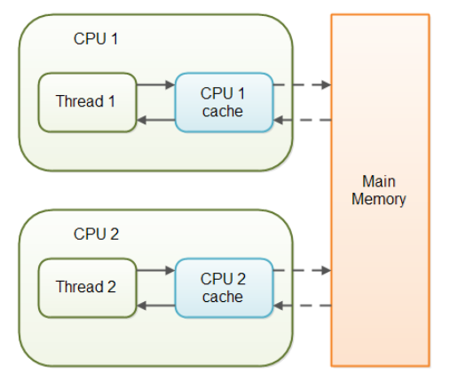
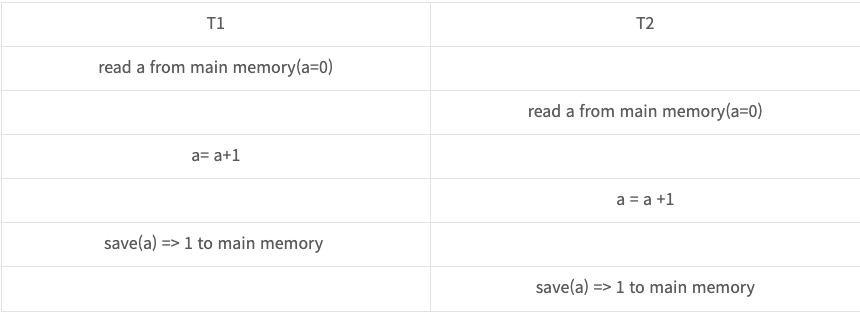

## Multi thread

### Field member

필드는 클래스에 변수를 정의하는 공간이다.
여러 스레드에 접근하는 싱글톤 객체라면 필드에 상태값을 가지고 있으면 안되고, 모든 변수를 파라미터로 넘겨 받고 return 해주어야함

### 동기 / 비동기

처리할 작업들을 어떤 흐름으로 처리할 것인지에 대한 관점

#### 동기 (Synchronous)

함수의 호출과 응답이 동시에 이루어짐
응답이 바로 오지 않더라도, 응답을 받기 위해 완료여부를 계속 체크함

#### 비동기 (Asynchronous)

함수의 호출과 응답이 동시에 이루어지지 않음 (콜백 등을 통해 응답을 받음)
응답이 오지 않아도 신경 X

### 블로킹 / 논블로킹

한 작업이 전체적인 흐름을 막는지 안막는지에 대한 관점 (=제어권이 누구한테 있는지)

### 블로킹 (Blocking)

함수 호출 후 응답을 받기까지 멈춰있어야함

### 논블로킹 (Non-Blocking)

함수 호출 수 응답이 오지 않아도 다른 작업을 할 수 있음
= 제어권이 다른 함수로 넘어가지 않음

### Java의 동기화 (Synchronized)

하나의 스레드만 실행할 수 있는 메소드, 블록
다른 스레드는 메소드, 블록 실행이 끝날 때까지 대기해야함
synchronized키워드를 남발하면 잦은 block으로 인해 성능이 저하될 수 있다.

```java
    public class SynchThread extends Thread {
    int total = 0;

    @Override
    public void run() {
        synchronized (this) { // 해당 객체(this)에 Lock 이 걸린다.
            for (int i = 0; i < 5; i++) {
                System.out.println(i + "를 더한다.");
                total += i;

                try {
                    Thread.sleep(500);
                } catch (InterruptedException e) {
                    e.printStackTrace();
                }
            }
            notify(); // 작업이 모두 끝나면 notify()를 호출하여 다른 쓰레드를 실행 대기 상태로 만든다.
        }
    }
}
```

### Volatile

Java의 Volatile 키워드를 사용하면 변수를 read / write 할 때 CPU cache가 아닌 메인 메모리에 하겠다고 명시적으로 선언하는 것이다.


스레드는 각 스레드의 CPU cache를 참조하기 때문에 공유 변수의 경우 다른 값을 읽어오는 문제가 생기기 때문에 사용됨

#### volatile의 문제점

**멀티스레드의 동기화 문제점 2가지**

1. race condition (여러 스레드가 동시에 경쟁)
2. visibility (가시성)

volatile는 2번 문제를 해결하는 방법이다.

[Race Condition]


-> volatile는 2개 이상의 스레드가 write를 하는 경우 부적합함

### Thread Local

스레드 별로 서로 다른 값을 처리해야 하는 경우 사용 (스레드의 지역변수 느낌)

#### 주의사항

Thread pool 환경에서 사용한다면 remove() 메소드를 사용하여 ThreadLocal 변수를 초기화하는 것이 필요하다.

#### 참고자료

https://theheydaze.tistory.com/612
https://inpa.tistory.com/entry/%F0%9F%91%A9%E2%80%8D%F0%9F%92%BB-%EB%8F%99%EA%B8%B0%EB%B9%84%EB%8F%99%EA%B8%B0-%EB%B8%94%EB%A1%9C%ED%82%B9%EB%85%BC%EB%B8%94%EB%A1%9C%ED%82%B9-%EA%B0%9C%EB%85%90-%EC%A0%95%EB%A6%AC
https://wjdtn7823.tistory.com/65
