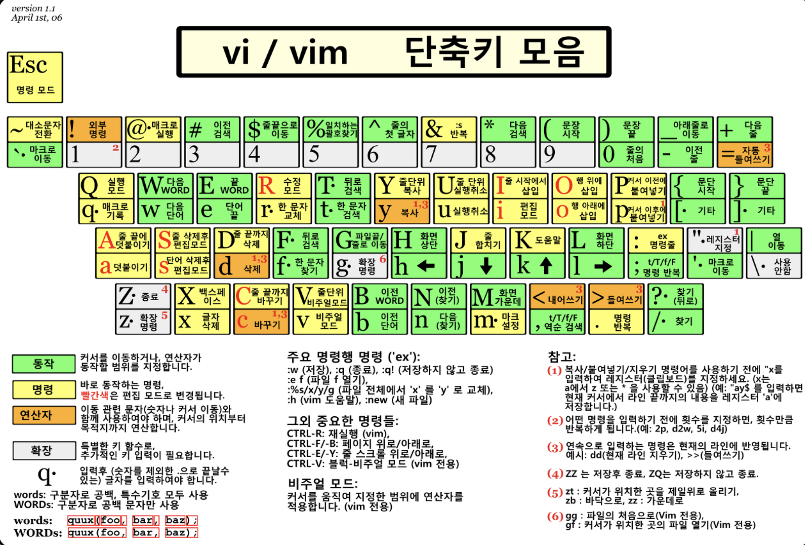

## Vi & Vim

#### 파일 열기

```sh
vi file.txt
```

- 파일이 존재하지 않는 경우, 파일 생성 후 열기
- 파일이 존재하는 경우 파일 열고 수정

#### 읽기모드로 파일 열기

```sh
view file.txt
```

### 커서 이동

- h(좌)
- j(하)
- k(상)
- l(우)
- Enter (한 행 아래로 이동)
- back space (한 문자 왼쪽으로 이동)
- space bar (한 문자 오른쪽으로 이동)
- ^ (한 행 제일 왼쪽으로 이동)
- & (한 행 제일 오른쪽으로 이동)

### 문자 입력

- i (커서 왼쪽에 문자 삽입)
- a (커서 오른쪽에 문자 삽입)
- o (커서 아래에 새로운 행을 만들고 문자 삽입)
- 위 문자 입력 시 입력모드로 전환

### 문자 삭제

- x (커서가 위치한 문자 삭제)
- dd (커서가 위치한 행 삭제)

### 탐색

- /word (word를 찾아서 이동)
- n (다음 word로 이동)
- N (이전 word로 이동)

### 저장 및 종료

- :w (저장)
- :q (종료)
- :wq (저장 후 종료)
- :q! (저장하지 않고 종료)



#### 참고자료

[link](https://danielit.tistory.com/15)
