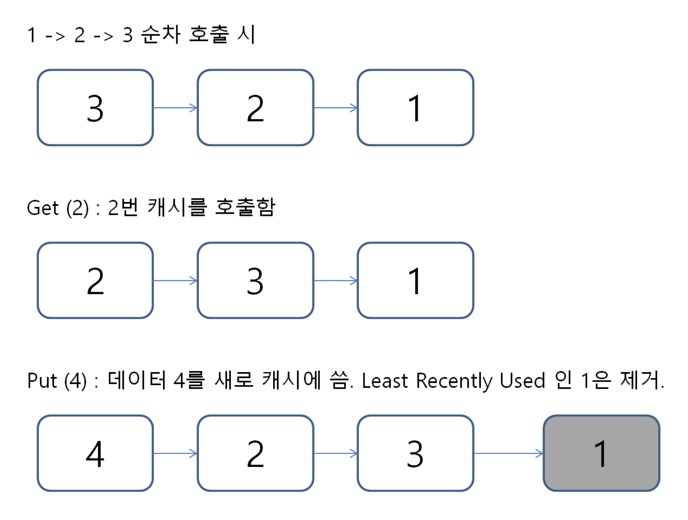

## Cache

- 연산에 필요한 데이터, 값을 미리 갖다 놓는 임시 메모리
- CPU 바로 옆에 있기때문에 접근 비용이 매우 적음
- 캐시 히트율을 높게 유지하기 위한 메모리 교체 알고리즘이 필요함

### LRU Cache

LRU(Least Recently Used): 가장 오랫동안 사용되지 않은 페이지를 교체 대상으로 삼는 기법

#### 구현 방식

- Double Linked List로 구현
- Head에 가까울수록 최근에 사용된 데이터, Tail에 가까울수록 오래 사용하지 않은 데이터
- 새로운 데이터 삽입 시 Tail 값 먼저 삭제, Head에 데이터 삽압
- 캐시 교체 시간복잡도 O(1)
- 캐시에 적재된 데이터를 사용한 경우, 데이터를 Head로 옮김

#### 참고자료

https://velog.io/@haero_kim/LRU-Cache-%EC%9D%B4%ED%95%B4%ED%95%98%EA%B8%B0
