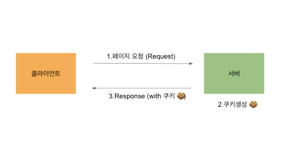
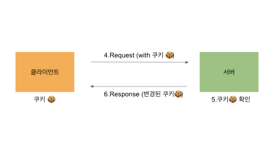

## Cookie & Session

- HTTP는 connectionless, stateless한 특징을 가지고 있음
- 서버에서 클라이언트를 식별하기 위해 쿠키와 세션을 사용함

### cookie

- 사용자 브라우저에 저장됨
- key, value 로 구성
- 통신 시 HTTP헤더에 포함하여 서버에 전송됨
- 이름(key), 값(value), 유효시간, 도메인(쿠키를 전송할 도메인), 경로정보(쿠키를 전송할 요청 경로) 포함
- 사용자 브라우저에 저장된 값을 확인가능하기 때문에 보안성이 낮음\

### session

- 쿠키와 달리 서버에서 관리
- 클라이언트에 세션ID부여, 브라우저 종료할 때까지 인증상태 유지됨
- 서버에 저장되므로, 데이터 탈취가 어려움, 보안성이 비교적 높음
- 하지만, 동접자 수가 많은 경우 서버에 과부하를 주어 성능저하 원인이 됨

#### 동작 방식

1. 클라이언트 -> 서버 접속 시 세션ID를 발급 받음
2. 클라이언트는 세션ID를 쿠키로 저장하여 가지고 있음
3. 클라이언트는 서버에 요청 시 쿠키의 세션ID를 같이 전송
4. 서버는 세션ID로 클라이언트를 식별하고 응답함

#### 참고자료

https://suyeoniii.tistory.com/82
https://interconnection.tistory.com/74
