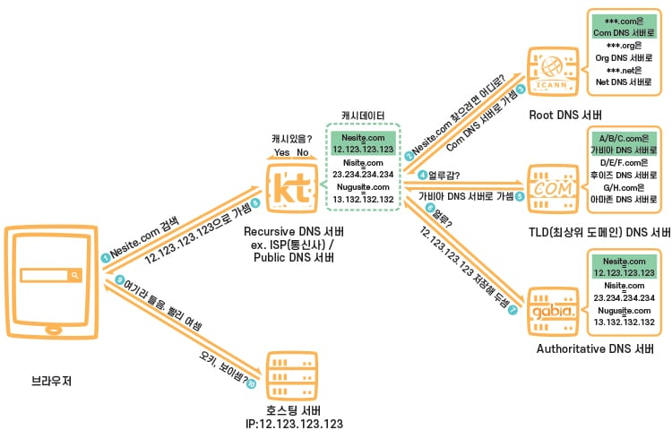

## DNS

- IP 주소 <-> 도메인 연결을 위한 데이터베이스 시스템
- 도메인마다 DNS와 연결해주는 DNS 서버(네임 서버)가 있음

### Round Robin DNS

- Round Robin = 우선순위를 두지 않고 순서대로 할당하는 알고리즘
- DNS를 이용한 트래픽 분산 기법
- 도메인 주소 입력 시 여러 IP 리스트에서 라운드 로빈 형태로 선택하여 사용자에게 알려줌
- 일반적인 로드밸런싱과 다르게 서버의 health check가 불가능하다는 단점이 있음

#### 참고자료

https://gentlysallim.com/dns%EB%9E%80-%EB%AD%90%EA%B3%A0-%EB%84%A4%EC%9E%84%EC%84%9C%EB%B2%84%EB%9E%80-%EB%AD%94%EC%A7%80-%EA%B0%9C%EB%85%90%EC%A0%95%EB%A6%AC/
https://m.blog.naver.com/techtrip/221691155719
