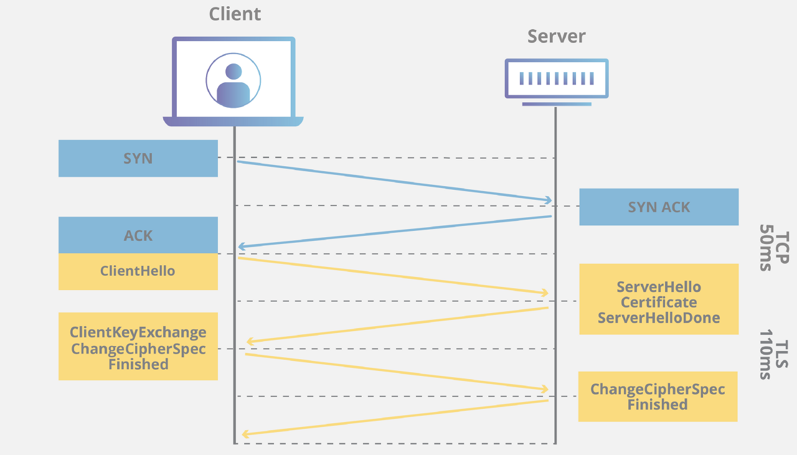

## HTTP

### HTTP 버전

#### 0.9

- 1991년, HTTP 초기 버전을 의미
- 요청은 단일 라인
- GET method만 존재
- HTTP 헤더 없음
- HTML 파일만 전송 가능

#### 1.0

- 1996년
- HTTP 헤더 도입
- HTTP 버전 정보도 함께 전송
- 응답에 상태 코드 추가됨
- Content-Type이 추가되어 HTML 이외의 문서 전송이 가능해짐
- 커넥션 하나 당 요청 하나와 응답 하나만 처리 가능 -> 1.1에서 개선

#### 1.1

- 1997년, 현재 가장 많이 사용중
- 지정 timeout동안 커넥션을 닫지 않아 커넥션 하나에 여러 요청, 응답을 처리할 수 있게됨
- 앞 요청의 응답을 기다리지 않고 여러 요청을 연속적으로 보내고 각 응답을 받는 방식 등장
- Head Of Line Blocking (HOLB) - 앞 요청이 너무 오래 걸리면 뒤 요청들이 Blocking 되어버림
- 연속된 요청의 헤더 중복이 발생

#### 2.0

- 2015년, 표준의 확장
- `HTTP 메시지 전송 방식 전환 (Binary Framing)` - 기존 text 형식을 프레임 단위로 나누어 바이너리 형식으로 인코딩하여 전송. 속도가 향상됨
- `Multiplexed Streams` - 한 커넥션에 동시에 여러 메세지를 주고받을 수 있음 (Stream)
- `Stream Prioritization` - 응답에 대한 우선순위 기능
- `Server Push`- 서버가 클라이언트의 요청에 여러 응답을 보낼 수 있음. 추가적인 리소스 전달 가능
- `Header Compression` - Header Table, Huffman Encoding을 통해 동일 헤더는 테이블의 index만 보내고 변경된 값은 Huffman Encoding 후 보냄으로써 Header의 크기 줄임

#### 3.0

- UDP 기반인 QUIC을 사용함
- 속도 향상 - TLS를 이용한 암호화 통신까지 TCP는 2~3 RTT, QUIC는 1 RTT
- HOLB 현상 해결 - stream 하나에 문제가 생기면 다른 stream에도 영향이 가서 전체적인 지연 발생 -> 독립 스트림 적용 (스트밍리 서로 영향 미치지 않음)
- 패킷 손실 감지 시간 단축 - 패킷 번호 공간을 부여하여 문제 발생 시 다른 패킷에 영향이 가지 않음

### GET vs POST

| GET                                         | POST                         |
| ------------------------------------------- | ---------------------------- |
| 캐시 o                                      | 캐시 x                       |
| 브라우저 기록 o                             | 브라우저 기록 x              |
| 북마크 추가 o                               | 북마크 추가 x                |
| 응답 코드 200                               | 응답 코드 201                |
| 리소스 요청                                 | 리소스 생성                  |
| 쿼리스트링으로 리소스 전달                  | Body로 리소스 전달           |
| 같은 요청을 여러 번 보내도 같은 결과를 받음 | <- 같은 결과가 보장되지 않음 |

### Header

#### 공통 헤더

- 요청, 응답 헤더에 필수로 포함됨
- Date: `Wed, 21 Oct 2015 07:28:00 GMT`, 자동 생성
- Connection: 현재의 전송이 완료된 후 네트워크 접속을 유지할지 (Keep-alive, close)
- Cache-Control: 캐싱 허용여부
- Content-Encoding: 인코딩 방식

#### 요청 헤더

- Host: 서버 도메인, (포트)
- User-Agent: 사용자가 어떤 클라이언트를 통해 요청을 보냈는지
- Accept: 응답으로 받을 타입 지정
- Authorization: 인증 관련 정보 (Bearer 토큰 등)
- Origin: 요청을 보낸 주소 (프로토콜, host, port)
- Referer: 이전 페이지 주소

#### 응답 헤더

- Access-Control-Allow-Origin: 클라이언트 주소를 작성하여 CORS 허용
- Allow: 특정 메서드만 허용 (GET, POST, HEAD 등)
- Content-Disposition: 응답 본문을 브라우저가 어떻게 표시해야 할지 알려줌 (inline - 웹페이지에 표시, attachment - 다운로드)
- Location - 이동할 페이지
- Content-Security-Policy: 외부 파일을 불러올 경우 차단할 소스, 불러올 소스 명시

#### 엔티티 헤더

- Entity-Body가 있을 때 포함되는 헤더
- Content-Length: Header + Body의 크기, 자동 생성
- Content-Type: 데이터의 미디어 타입, 문자열 인코딩
- Content-Language: 언어
- Content-Encoding: 인코딩 방식

### HTTP, HTTPS 동작 과정

#### HTTP 동작 과정

1. 사용자가 웹 브라우저에 URL 주소 입력
2. DNS 서버에 웹 서버의 호스트 이름을 IP 주소로 변경 요청
3. 웹 서버와 TCP 연결 시도 (3-way hadnshaking)
4. Request (GET)
5. Response (200 OK)
6. 4-way handshking
7. 웹 브라우저가 웹 문서 출력

#### HTTPS 동작 과정

- 공개키, 대칭키 암호화 방식 사용

#### SSL Handshake

1. Client Hello
   - 클라이언트 -> 서버로 패킷 전송
   - 패킷 - 클라이언트에서 사용 가능한 암호화 알고리즘 목록, 랜덤 데이터, 세션 id 등
2. Server Hello
   - 서버 -> 클라이언트로 패킷 전송
   - 패킷 - 클라이언트에게 받은 암호화 알고리즘 중 선택한 1개의 알고리즘, 랜덤 데이터 등
   - 패킷2 - SSL 인증서
3. Client 에서 SSL 인증서 검증
   - 클라이언트는 CA의 공개키를 이용해 SSL 인증서 복호화
   - CA 공개키는 브라우저에 주요 CA 목록과 함께 저장되어있고 목록에 없는 경우 외부 인터넷을 통해 CA 정보 확보
4. 클라이언트 -> 서버 대칭키 전달
   - 클라이언트에서 서버와 주고받을 데이터 암호화를 위한 대칭키 생성
   - 서버만 볼 수 있게 하기 위해 서버의 공개키로 암호화해서 전달 (SSL 인증서 복호화 시 얻음)
5. Server / Client SSL Handshake Finished
   - 서버에서 클라이언트가 전달한 대칭키 받음
   - 서버가 가지고 있는 비밀키로 복호화해서 얻음
   - 클라이언트, 서버 둘다 동일한 대칭키를 가지고 있게 되므로 통신 준비 완료

#### 참고자료

https://velog.io/@songyouhyun/Get%EA%B3%BC-Post%EC%9D%98-%EC%B0%A8%EC%9D%B4%EB%A5%BC-%EC%95%84%EC%8B%9C%EB%82%98%EC%9A%94
https://wonit.tistory.com/308
https://velog.io/@averycode/%EB%84%A4%ED%8A%B8%EC%9B%8C%ED%81%AC-HTTP%EC%99%80-HTTPS-%EB%8F%99%EC%9E%91-%EA%B3%BC%EC%A0%95
https://nuritech.tistory.com/25
