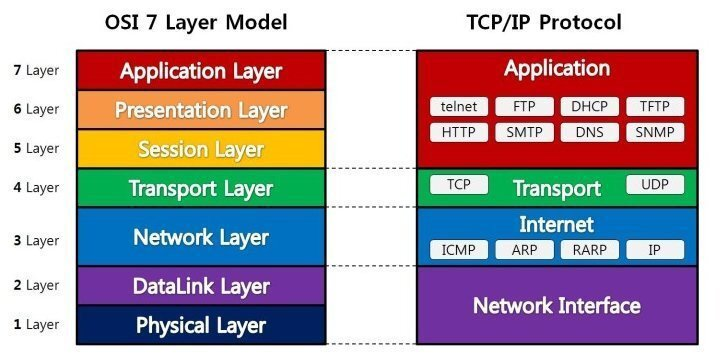
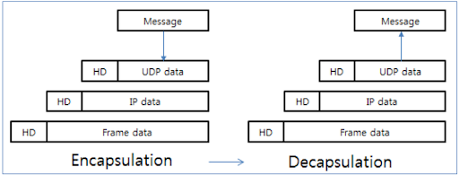

## OSI 7 계층

OSI 7 계층은 네트워크 통신이 일어나는 과정을 7단계로 나눈 것
 
초기 통신 장비들은 각 업체 장비끼리만 연결이 되는 문제가 있었고, 표준을 정하기 위해 OSI 7 계층이 만들어짐

### 1계층 - 물리계층 (Physical Layer)

- 전기적, 기계적, 기능적인 특성을 이용하여 통신 케이블로 데이터를 전송함
- 데이터를 전기적인 신호로 변환하여 주고받는 기능을 함 (통신 단위 = 비트(0, 1))
- 데이터 전달이 목적이기때문에, 주고받는 데이터가 무엇인지, 어떤 오류가 있는지 등은 신경 쓰지 않음
- 대표적인 장비 - 케이블, 리피터, 허브 등

### 2계층 - 데이터 링크계층(DataLink Layer)

- 신뢰성있는 정보의 전달을 수행할 수 있도록 도와주는 역할
- 통신 시 오류를 찾거나 재전송하는 기능이 존재함
- MAC 주소를 통해 통신함
- 전송 단위 = 프레임(Frame)
- 대표적인 장비 - 브리지, 스위치 등

### 3계층 - 네트워크 계층(Network Layer)

- 데이터를 목적지까지 가장 안전하고 빠르게 전달하는 기능을 가짐 (라우팅)
- 경로를 선택하고, 주소를 정하고(IP), 경로에 따라 패킷을 전달(Route)해주는 것이 주요 역할
- 라우팅, 흐름 제어, 세그멘테이션, 오류 제어, 인터네트워킹 등을 수행함
- 데이터 단위 = 패킷(Packet)
- 대표적인 장비 - 라우터, L3 스위치

### 4계층 - 전송 계층(Transport Layer)

- 종단 간 신뢰성 있고 정확한 데이터 전송을 담당
- 데이터 전송을 위해 Port번호를 사용함
- 오류검출 및 복구, 흐름제어와 중복검사 등을 수행
- 데이터 단위 = 세그먼트(Segment)
- 대표적인 예 - TCP, UDP

### 5 계층 - 세션 계층(Session Layer)

- 데이터가 통신하기 위한 논리적인 연결
- 통신 장치 간 상호작용 및 동기화를 제공
- 세션에서 데이터 교환과 에러 발생 시의 복구를 관리

### 6계층 - 표현 계층(Presentation Layer)

- 데이터를 어떻게 표현할지 정하는 역할
- 인코딩, 암호화, 압축 등 코드 간 번역을 수행함

### 7계층 - 응용 계층(Application Layer)

- 최종 목적지
- 응용 프로세스 간 정보 교환을 담당
- HTTP, FTP, SMTP, POP3, IMAP, Telnet 등의 프로토콜이 있음
- 전자메일, 인터넷, 동영상 플레이어 등

### 캡슐화 / 역캡슐화

- 캡슐화: 전송 시 각 계층마다 필요한 헤더를 붙임 (7계층 -> 1계층)
- 역캡슐화: 수신 시 한 받은 헤더를 떼어냄 (1계층 -> 7계층)

#### 참고자료

https://shlee0882.tistory.com/110
https://velog.io/@cgotjh/%EB%84%A4%ED%8A%B8%EC%9B%8C%ED%81%AC-OSI-7-%EA%B3%84%EC%B8%B5-OSI-7-LAYER-%EA%B8%B0%EB%B3%B8-%EA%B0%9C%EB%85%90-%EA%B0%81-%EA%B3%84%EC%B8%B5-%EC%84%A4%EB%AA%85
https://velog.io/@qmasem/TIL-%EB%84%A4%ED%8A%B8%EC%9B%8C%ED%81%AC-%EC%BA%A1%EC%8A%90%ED%99%94-%EC%97%AD%EC%BA%A1%EC%8A%90%ED%99%94-encapsulation-decapsulation
