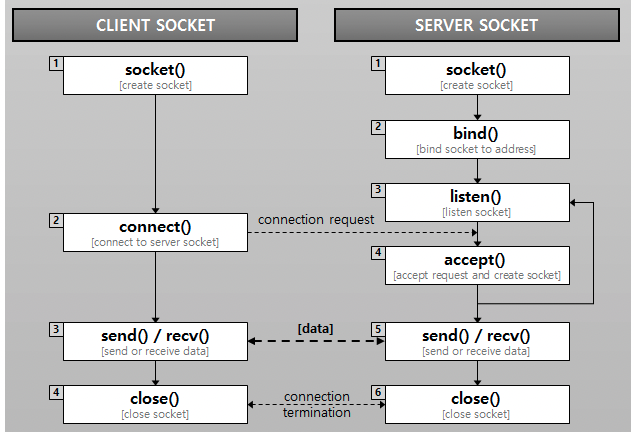

## Socket

- 두 호스트를 연결해주는 도구. 소켓을 통해 데이터 통로가 만들어진다.
- 프로토콜, IP, Port로 구성

### 소켓 통신 과정

- 서버 - 클라이언트 소켓의 연결 요청을 대기하고, 연결 요청이 들어오면 클라이언트 소켓을 생성하여 통신 가능하게함, 연결 요청을 받고 있는 소켓이 필요하기 때문에 클라이언트 소켓과 연결할 때 다른 연결 요청을 받을 소켓을 하나 더 생성함
- 클라이언트 - 실제 데이터 송수신이 일어나는 것은 클라이언트 소켓

#### 소켓 종류

#### 스트림 소켓

- TCP를 사용하는 연결 지향방식 소켓

#### 데이터그램 소켓

- UDP를 사용하는 비연결형 소켓

### HTTP 통신과 소켓 통신의 차이점

HTTP

- 클라이언트 요청에 서버가 응답
- JSON, HTML, Image등 다양한 데이터 주고 받음
- 단방향 통신, 서버가 응답 후 연결을 바로 종료 하거나 일정 시간동안 커넥션 유지
- 실시간 연결이 아닌 데이터 전달이 필요한 경우 유리

Socket

- 클라이언트와 서버가 특정 포트로 양방향 통신
- 데이터 전달 후에도 연결 유지
- 실시간으로 데이터를 주고받는 경우 유리
- 실시간 동영상 스트리밍, 온라인 게임 등

### WebSocket

- HTML5 웹 표준 기술
- 양방향 소통을 위한 프로토콜
- 이벤트를 듣고 보내는 것만 가능
- 빠르게 작동하며 통신할 때 적은 데이터 이용
  -> 데이터 전송이 많은 경우 유리

### Socket.io

- 양방향 통신을 하기위해 웹소켓 기술을 활용하는 라이브러리
- 소켓 연결 실패 시 다른 방식으로 알아서 클라이언트와 연결 시도
- 서버에서 사용할 경우 클라이언트도 사용 필요
- 일부 클라이언트에게만 데이터를 전송하는 브로드캐스팅이 가능
  -> 연결된 소켓을 세밀하게 관리해야하는 경우 유리

#### 참고자료

https://velog.io/@newdana01/%EC%86%8C%EC%BC%93%EC%9D%B4%EB%9E%80-%EC%A2%85%EB%A5%98-%ED%86%B5%EC%8B%A0-%ED%9D%90%EB%A6%84-HTTP%ED%86%B5%EC%8B%A0%EA%B3%BC%EC%9D%98-%EC%B0%A8%EC%9D%B4
