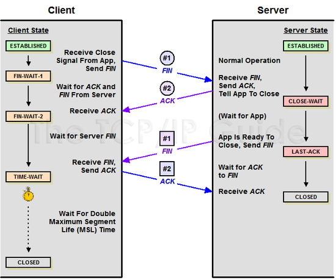
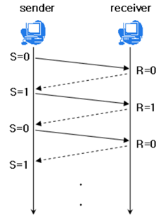

## TCP/IP, UDP

### TCP/IP

#### TCP

TCP = 전송 제어 프로토콜(Transmission Control Protocol)

- 데이터를 패킷으로 컴파일하여 다른 TCP계층으로 전송
- 전달받은 패킷을 재조립하고 오류가 있는 패킷인 경우 재전송을 요청하는 패킷을 전송

#### IP

IP = 인터넷 프로토콜(Internet Protocal)

- 인터넷에서 컴퓨터의 위치를 찾아 데이터를 전송할 수 있도록 하는 일종의 인터넷 주소
- IPv4, IPv6

#### TCP/IP 4 계층

- OSI 7 Layer를 좀 더 추상화함

#### 네트워크 엑세스 계층

- 네트워크 매체와 TCP/IP패킷을 주고받는 역할
- 물리적인 주소로 MAC 사용
- LAN, 패킷망 등

#### 인터넷 계층

- 어드레싱, 패키징, 라우팅 기능
- 네트워크상 최종 목적지까지 정확히 연결되도록 연결성 제공
- IP, ARP, RARP 프로토콜

#### 전송 계층

- 응용 계층에 세션, 데이터그램 통신서비스 제공
- 노드 간 연결 제어, 신뢰성 있는 데이터 전송 담당
- TCP, UDP

#### 응용 계층

- 프로그램과 직접 상호작용하는 레이어
- FTP, HTTP, SSH 프로토콜 등

### TCP 3 way handshake

데이터 전송 전 명확한 전송을 보장하기 위해 상대방과 세션을 수립하는 과정

1. 클라이언트 -> 서버 SYN(연결 요청) (클라이언트 상태 = SYN_SENT)
2. 서버는 SYN 패킷을 받고 A에게 요청을 수락한다는 ACK(응답)와 SYN flag가 절정된 패킷 전송 (서버 상태 = SYN_RECEIVED)
3. 클라이언트 -> 서버 ACK 전송, 연결됨 (서버상태 = ESTABLISHED)

### TCP 4 handshake

세션을 종료하는 과정

1. 클라이언트 -> 서버 FIN(종료 요청) 플래그 전송
2. 서버 -> ACK 전송, 자신의 통신이 끝날 때까지 기다림 (서버 상태 = TIME_WAIT)
3. 서버의 통신이 끝났으면 연결이 종료되었다고 클라이언트에게 FIN 전송
4. 클라이언트 -> 서버 ACK 전송
5. 여러 이유로 FIN 이후에 도착하는 패킷이 있을 수 있기때문에 클라이언트는 FIN을 수신한 뒤 일정 시간동안은 잉여 패킷을 기다리게됨

### TCP 흐름 제어, 혼잡 제어

#### 흐름 제어

- 송신측과 수신측의 데이터 처리 속도 차이를 해결하기 위한 기법
- flow control은 receiver가 packet을 지나치게 많이 받지 않도록 조절
- receiver가 sender에게 현재 자신의 상태를 전송하게됨

##### 해결 방법

1. stop and wai
   - 매번 전송한 패킷에 대해 확인 응답을 받아야만 다음 패킷을 전송함
     
2. sliding window
   - 수신측에서 설정한 윈도우 크기만큼은 송신측에서 확인응답없이 세그먼트를 전송할 수 있게함
     

#### 혼잡 제어

송신측의 데이터 전달과 네트워크의 데이터 처리 속도 차이를 해결하기 위한 기법

##### 해결 방법

1. AIMD (Additional Increase / Multiplicative Decrease)
   - 처음에 패킷을 하나씩 보내고 이것이 문제없이 도착하면 Window 크기 (단위 시간 내에 보내는 패킷 수)를 1씩 증가시켜나가며 전송하는 방법
   - 전송이 실패하면 패킷 속도를 절반으로 줄임
   - 단점은 처음 전송 속도룰 올리는데 오래 걸리는 것
2. Slow start (느린 시작)
   - 초기 window size는 1
   - 매 RTT마다 window 사이즈를 2배 키움
   - 혼잡 상황 발생 시 window size를 1로 떨어뜨림
   - 초기에는 네트워크 정보가 없지만 혼잡 현상 발생 시 네트워크 수용량을 어느정도 알 수 있음
   - 혼잡 현상이 발생했던 window size까지는 지수 함수 꼴로 증가시키고, 이후 1씩 증가시킴
3. Fast Retransmit (빠른 재전송)
   - 수신측에서 잘 받은 패킷의 다음 패킷 순번을 ACK 패킷에 보냄.
   - 중간에 패킷을 못받은 경우 특정 패킷의 ACK를 중복해서 보내게됨
   - 송신측에서 중복 순번 패킷을 3개 받으면 재전송. 혼잡을 감지하고 window size를 줄임
4. Fast Recovery (빠른 회복)
   - 혼잡한 상태가 되면 window size를 1로 줄이지 않고 반으로 줄이고 선형증가 시킴

### TCP와 UDP

둘다 전송 계층에서 사용하는 프로토콜

#### TCP 특징

- 연결 지향 방식
- 3-way handshaking을 통해 연결하고 4-way handshaking을 통해 연결을 해제함
- 높은 신뢰성 보장
- 흐름 제어, 혼잡 제어
- UDP보다 느린 속도
- 전이중(Full-Duplex), 점대점(Point to Point)방식

#### UDP 방식

- 비연결형 서비스, 데이터그램 방식 제공(=독립적인 패킷)
- 정보를 주고 받을 때 보내거나 받는다는 신호절차 거치지 않음
- 신뢰성이 낮음
- TCP보다 속도가 빠름
- UDP 헤더의 checksum 필드로 최소한의 오류 검출
- 신뢰성보다 연속성이 중요한 실시간 서비스 등에 주로 사용됨

#### 참고자료

https://coding-factory.tistory.com/613
https://mindnet.tistory.com/entry/%EB%84%A4%ED%8A%B8%EC%9B%8C%ED%81%AC-%EC%89%BD%EA%B2%8C-%EC%9D%B4%ED%95%B4%ED%95%98%EA%B8%B0-22%ED%8E%B8-TCP-3-WayHandshake-4-WayHandshake
https://gyoogle.dev/blog/computer-science/network/%ED%9D%90%EB%A6%84%EC%A0%9C%EC%96%B4%20&%20%ED%98%BC%EC%9E%A1%EC%A0%9C%EC%96%B4.html
https://mangkyu.tistory.com/15
